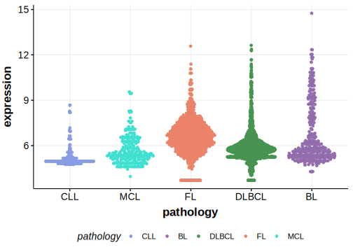

[[_TOC_]]

## Relevance tier by entity

[[include:tables/table1_PCLO.md]]

## Mutation incidence in large patient cohorts (GAMBL reanalysis)

|Entity|source        |frequency (%)|
|:------:|:--------------:|:-------------:|
|DLBCL |GAMBL genomes |16.44        |
|DLBCL |Schmitz cohort|21.28        |
|DLBCL |Reddy cohort  |15.12        |
|DLBCL |Chapuy cohort |23.08        |
|FL    |GAMBL genomes | 9.24        |

## Mutation pattern and selective pressure estimates

[[include:tables/dnds_PCLO.md]]

## PCLO Hotspots

| Chromosome |Coordinate (hg19) | ref>alt | HGVSp | 
 | :---:| :---: | :--: | :---: |
| chr7 | 82585303 | G>T | L1656I |
| chr7 | 82585302 | A>G | L1656P |
| chr7 | 82544727 | T>C | K4192R |

[[include:browser_PCLO.md]]

## Expression

[[include:tables/mermaid_PCLO.md]]

## References

<!-- ORIGIN: lohrDiscoveryPrioritizationSomatic2012a -->
<!-- DLBCL: lohrDiscoveryPrioritizationSomatic2012a -->
