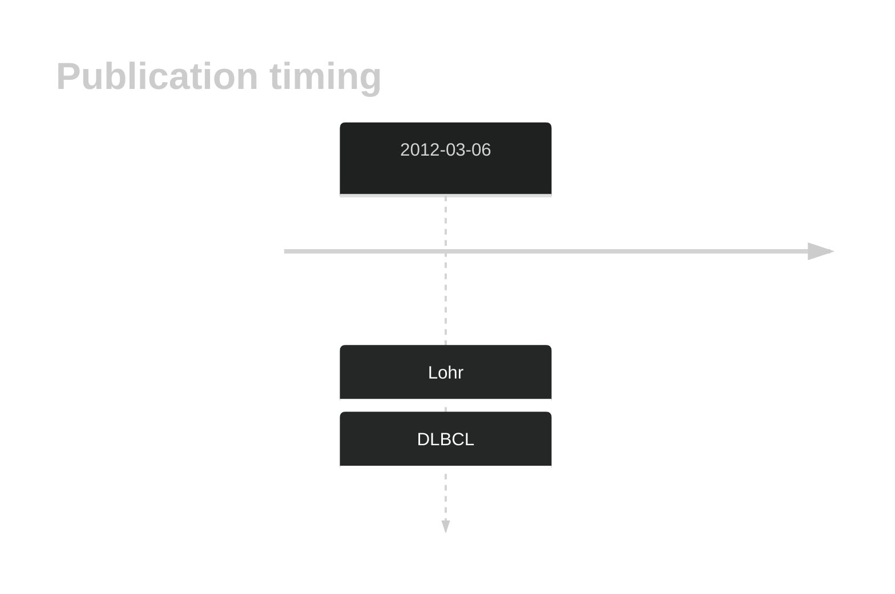

# PCLO

## History

## Relevance tier by entity

|Entity|Tier|Description                              |
|:------:|:----:|-----------------------------------------|
||1|high-confidence MZL gene|
||1|high-confidence PMBL/cHL/GZL gene|
| |2   |relevance in DLBCL not firmly established[@lohrDiscoveryPrioritizationSomatic2012a]|
|    |1   |high-confidence FL gene                  |

## Mutation incidence in large patient cohorts (GAMBL reanalysis)

|Entity|source        |frequency (%)|
|:------:|:--------------:|:-------------:|
|DLBCL |GAMBL genomes |16.44        |
|DLBCL |Schmitz cohort|21.28        |
|DLBCL |Reddy cohort  |15.12        |
|DLBCL |Chapuy cohort |23.08        |
|FL    |GAMBL genomes | 9.24        |

## Mutation pattern and selective pressure estimates

|Entity|aSHM|Significant selection|dN/dS (missense)|dN/dS (nonsense)|
|:------:|:----:|:---------------------:|:----------------:|:----------------:|
|BL    |No  |No                   |0.000           |0.000           |
|DLBCL |No  |No                   |1.223           |0.389           |
|FL    |No  |No                   |0.000           |0.000           |

## PCLO Hotspots

| Chromosome |Coordinate (hg19) | ref>alt | HGVSp | 
 | :---:| :---: | :--: | :---: |
| chr7 | 82585303 | G>T | L1656I |
| chr7 | 82585302 | A>G | L1656P |
| chr7 | 82544727 | T>C | K4192R |

View coding variants in ProteinPaint [hg19](https://morinlab.github.io/LLMPP/GAMBL/PCLO_protein.html)  or [hg38](https://morinlab.github.io/LLMPP/GAMBL/PCLO_protein_hg38.html)

View all variants in GenomePaint [hg19](https://morinlab.github.io/LLMPP/GAMBL/PCLO.html)  or [hg38](https://morinlab.github.io/LLMPP/GAMBL/PCLO_hg38.html)

## PCLO Expression

## References

<!-- ORIGIN: lohrDiscoveryPrioritizationSomatic2012a -->
<!-- DLBCL: lohrDiscoveryPrioritizationSomatic2012a -->
