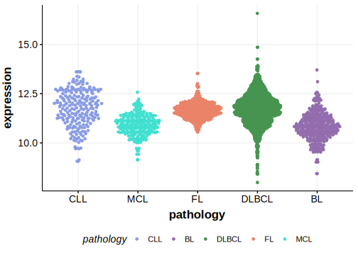

[[_TOC_]]

## Relevance tier by entity

[[include:tables/table1_PDE4DIP.md]]

## Mutation incidence in large patient cohorts (GAMBL reanalysis)

|Entity|source        |frequency (%)|
|:------:|:--------------:|:-------------:|
|DLBCL |GAMBL genomes |  NA         |
|DLBCL |Schmitz cohort|3.83         |
|DLBCL |Reddy cohort  |5.31         |
|DLBCL |Chapuy cohort |8.55         |

## Mutation pattern and selective pressure estimates

[[include:tables/dnds_PDE4DIP.md]]

[[include:browser_PDE4DIP.md]]

## Expression

<!-- ORIGIN: chapuyMolecularSubtypesDiffuse2018b -->
<!-- DLBCL: chapuyMolecularSubtypesDiffuse2018b -->

## All Mutations

[DLBCL-RICOVER_107-Tumor](https://bcgsc.ca/downloads/morinlab/GAMBL/Chapuy_2018/DLBCL-RICOVER_107-Tumor.html)
[DLBCL-RICOVER_288-Tumor](https://bcgsc.ca/downloads/morinlab/GAMBL/Chapuy_2018/DLBCL-RICOVER_288-Tumor.html)
[DLBCL-RICOVER_384-Tumor](https://bcgsc.ca/downloads/morinlab/GAMBL/Chapuy_2018/DLBCL-RICOVER_384-Tumor.html)
[DLBCL-RICOVER_496-Tumor](https://bcgsc.ca/downloads/morinlab/GAMBL/Chapuy_2018/DLBCL-RICOVER_496-Tumor.html)

[[include:tables/mermaid_PDE4DIP.md]]

## References

