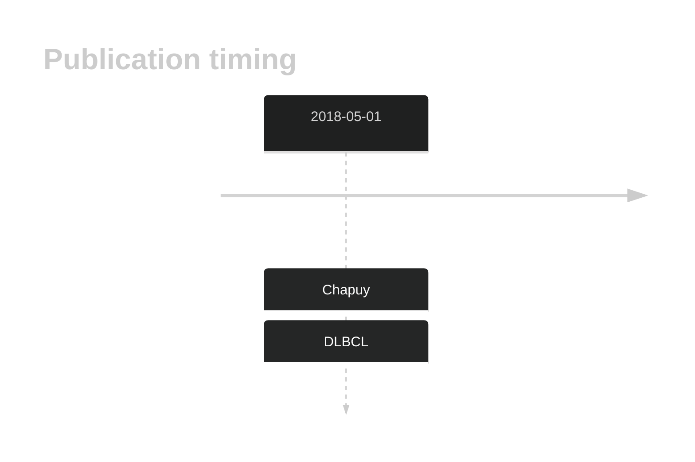

# PDE4DIP
## History

## Relevance tier by entity

|Entity|Tier|Description                              |
|:------:|:----:|-----------------------------------------|
| |2   |relevance in DLBCL not firmly established|

## Mutation incidence in large patient cohorts (GAMBL reanalysis)

|Entity|source        |frequency (%)|
|:------:|:--------------:|:-------------:|
|DLBCL |GAMBL genomes |  NA         |
|DLBCL |Schmitz cohort|3.83         |
|DLBCL |Reddy cohort  |5.31         |
|DLBCL |Chapuy cohort |8.55         |

## Mutation pattern and selective pressure estimates

|Entity|aSHM|Significant selection|dN/dS (missense)|dN/dS (nonsense)|
|:------:|:----:|:---------------------:|:----------------:|:----------------:|
|BL    |No  |No                   |1.344           |1.032           |
|DLBCL |No  |No                   |1.467           |5.897           |
|FL    |No  |No                   |2.010           |7.866           |

View coding variants in ProteinPaint [hg19](https://morinlab.github.io/LLMPP/GAMBL/PDE4DIP_protein.html)  or [hg38](https://morinlab.github.io/LLMPP/GAMBL/PDE4DIP_protein_hg38.html)

View all variants in GenomePaint [hg19](https://morinlab.github.io/LLMPP/GAMBL/PDE4DIP.html)  or [hg38](https://morinlab.github.io/LLMPP/GAMBL/PDE4DIP_hg38.html)

## PDE4DIP Expression

<!-- ORIGIN: chapuyMolecularSubtypesDiffuse2018b -->
<!-- DLBCL: chapuyMolecularSubtypesDiffuse2018b -->
## References
1.  Chapuy B, Stewart C, Dunford AJ, Kim J, Kamburov A, Redd RA, Lawrence MS, Roemer MGM, Li AJ, Ziepert M, Staiger AM, Wala JA, Ducar MD, Leshchiner I, Rheinbay E, Taylor-Weiner A, Coughlin CA, Hess JM, Pedamallu CS, Livitz D, Rosebrock D, Rosenberg M, Tracy AA, Horn H, van Hummelen P, Feldman AL, Link BK, Novak AJ, Cerhan JR, Habermann TM, Siebert R, Rosenwald A, Thorner AR, Meyerson ML, Golub TR, Beroukhim R, Wulf GG, Ott G, Rodig SJ, Monti S, Neuberg DS, Loeffler M, Pfreundschuh M, Trümper L, Getz G, Shipp MA. Molecular subtypes of diffuse large B cell lymphoma are associated with distinct pathogenic mechanisms and outcomes. Nat Med. 2018 May;24(5):679–690. PMCID: PMC6613387
