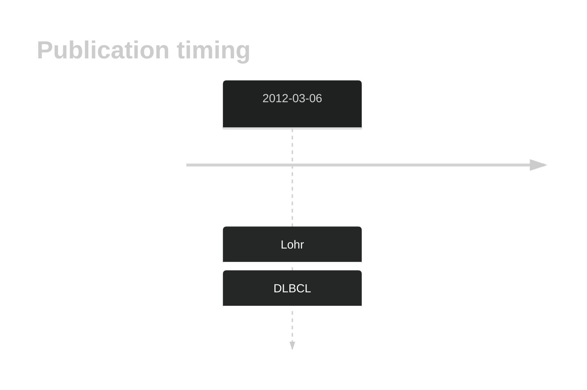

# PDGFC

## History

## Relevance tier by entity

|Entity|Tier|Description|
|:------:|:----:|--------------------------------------|
||2|relevance in DLBCL not firmly established[@lohrDiscoveryPrioritizationSomatic2012]|

## Mutation incidence in large patient cohorts (GAMBL reanalysis)

|Entity|source |frequency (%)|
|:------:|:----:|:----:|
|BL|GAMBL Exome |1.149 |
|BL|GAMBL Genome |1.158 |
|DLBCL|GAMBL Exome |2.049 |
|DLBCL|GAMBL Genome |1.316 |

## References

