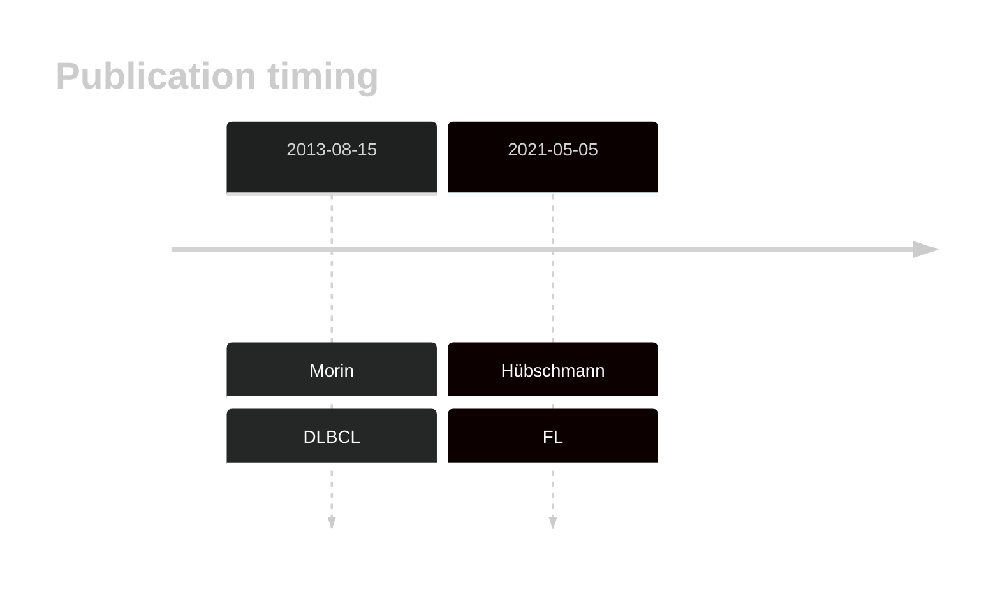
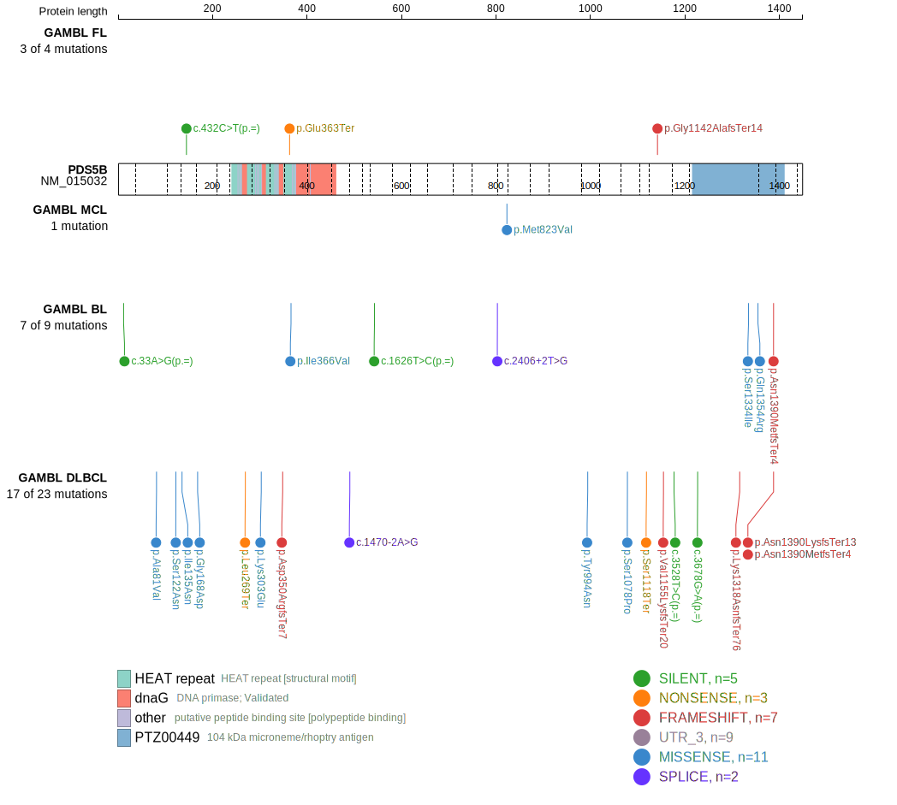
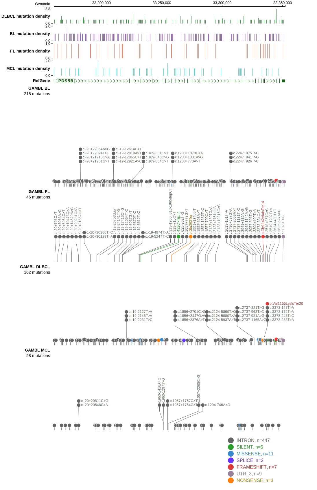
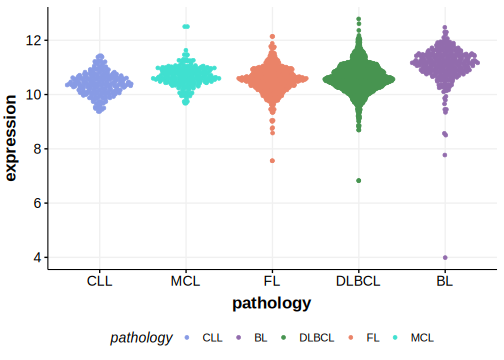

# PDS5B

## History

## Relevance tier by entity

|Entity|Tier|Description                              |
|:------:|:----:|-----------------------------------------|
| |2   |relevance in DLBCL not firmly established[@morinMutationalStructuralAnalysis2013]|
|    |2   |relevance in FL not firmly established   [@hubschmannMutationalMechanismsShaping2021b]|

## Mutation incidence in large patient cohorts (GAMBL reanalysis)

|Entity|source        |frequency (%)|
|:------:|:--------------:|:-------------:|
|DLBCL |GAMBL genomes |3.25         |
|DLBCL |Schmitz cohort|4.47         |
|DLBCL |Reddy cohort  |1.80         |
|DLBCL |Chapuy cohort |2.14         |
|FL    |GAMBL genomes |1.62         |

## Mutation pattern and selective pressure estimates

|Entity|aSHM|Significant selection|dN/dS (missense)|dN/dS (nonsense)|
|:------:|:----:|:---------------------:|:----------------:|:----------------:|
|BL    |No  |No                   |1.009           |2.705           |
|DLBCL |No  |No                   |1.333           |6.726           |
|FL    |No  |No                   |0.000           |9.065           |

View coding variants in ProteinPaint [hg19](https://morinlab.github.io/LLMPP/GAMBL/PDS5B_protein.html)  or [hg38](https://morinlab.github.io/LLMPP/GAMBL/PDS5B_protein_hg38.html)

View all variants in GenomePaint [hg19](https://morinlab.github.io/LLMPP/GAMBL/PDS5B.html)  or [hg38](https://morinlab.github.io/LLMPP/GAMBL/PDS5B_hg38.html)

## PDS5B Expression

## All Mutations

### FL2

[SP116618](https://www.bcgsc.ca/downloads/morinlab/GAMBL/MALY/SP116618.html)
[SP116686](https://www.bcgsc.ca/downloads/morinlab/GAMBL/MALY/SP116686.html)
[SP192804](https://www.bcgsc.ca/downloads/morinlab/GAMBL/MALY/SP192804.html)
[SP193025](https://www.bcgsc.ca/downloads/morinlab/GAMBL/MALY/SP193025.html)
[SP193130](https://www.bcgsc.ca/downloads/morinlab/GAMBL/MALY/SP193130.html)
[SP59360](https://www.bcgsc.ca/downloads/morinlab/GAMBL/MALY/SP59360.html)
[SP59452](https://www.bcgsc.ca/downloads/morinlab/GAMBL/MALY/SP59452.html)

## References

<!-- ORIGIN: morinMutationalStructuralAnalysis2013 -->
<!-- DLBCL: morinMutationalStructuralAnalysis2013 -->
<!-- FL: hubschmannMutationalMechanismsShaping2021b -->
