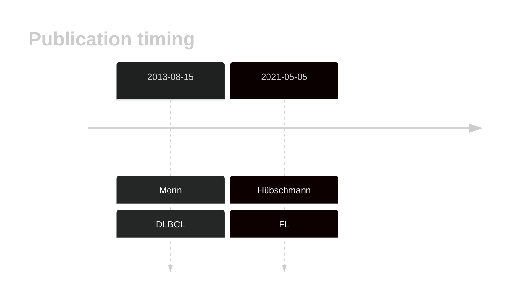

# PDS5B

## History
Mutations in this gene were first described in DLBCL in 2013 by Morin et al1 and in FL in 2021 by Hübschmann et al.2

## Relevance tier by entity

|Entity|Tier|Description                              |
|:------:|:----:|-----------------------------------------|
| |2   |relevance in DLBCL not firmly established|
|    |2   |relevance in FL not firmly established   |

## Mutation incidence in large patient cohorts (GAMBL reanalysis)

|Entity|source        |frequency (%)|
|:------:|:--------------:|:-------------:|
|DLBCL |GAMBL genomes |3.25         |
|DLBCL |Schmitz cohort|4.47         |
|DLBCL |Reddy cohort  |1.80         |
|DLBCL |Chapuy cohort |2.14         |
|FL    |GAMBL genomes |1.62         |

## Mutation pattern and selective pressure estimates

|Entity|aSHM|Significant selection|dN/dS (missense)|dN/dS (nonsense)|
|:------:|:----:|:---------------------:|:----------------:|:----------------:|
|BL    |No  |No                   |1.009           |2.705           |
|DLBCL |No  |No                   |1.333           |6.726           |
|FL    |No  |No                   |0.000           |9.065           |

View coding variants in ProteinPaint [hg19](https://morinlab.github.io/LLMPP/GAMBL/PDS5B_protein.html)  or [hg38](https://morinlab.github.io/LLMPP/GAMBL/PDS5B_protein_hg38.html)

View all variants in GenomePaint [hg19](https://morinlab.github.io/LLMPP/GAMBL/PDS5B.html)  or [hg38](https://morinlab.github.io/LLMPP/GAMBL/PDS5B_hg38.html)

## PDS5B Expression

## All Mutations

### FL2

[SP116618](https://www.bcgsc.ca/downloads/morinlab/GAMBL/MALY/SP116618.html)
[SP116686](https://www.bcgsc.ca/downloads/morinlab/GAMBL/MALY/SP116686.html)
[SP192804](https://www.bcgsc.ca/downloads/morinlab/GAMBL/MALY/SP192804.html)
[SP193025](https://www.bcgsc.ca/downloads/morinlab/GAMBL/MALY/SP193025.html)
[SP193130](https://www.bcgsc.ca/downloads/morinlab/GAMBL/MALY/SP193130.html)
[SP59360](https://www.bcgsc.ca/downloads/morinlab/GAMBL/MALY/SP59360.html)
[SP59452](https://www.bcgsc.ca/downloads/morinlab/GAMBL/MALY/SP59452.html)

## References
1.  Morin RD, Mungall K, Pleasance E, Mungall AJ, Goya R, Huff RD, Scott DW, Ding J, Roth A, Chiu R, Corbett RD, Chan FC, Mendez-Lago M, Trinh DL, Bolger-Munro M, Taylor G, Hadj Khodabakhshi A, Ben-Neriah S, Pon J, Meissner B, Woolcock B, Farnoud N, Rogic S, Lim EL, Johnson NA, Shah S, Jones S, Steidl C, Holt R, Birol I, Moore R, Connors JM, Gascoyne RD, Marra MA. Mutational and structural analysis of diffuse large B-cell lymphoma using whole-genome sequencing. Blood. 2013 Aug 15;122(7):1256–1265. PMCID: PMC3744992

2.  Hübschmann D, Kleinheinz K, Wagener R, Bernhart SH, López C, Toprak UH, Sungalee S, Ishaque N, Kretzmer H, Kreuz M, Waszak SM, Paramasivam N, Ammerpohl O, Aukema SM, Beekman R, Bergmann AK, Bieg M, Binder H, Borkhardt A, Borst C, Brors B, Bruns P, Carrillo de Santa Pau E, Claviez A, Doose G, Haake A, Karsch D, Haas S, Hansmann ML, Hoell JI, Hovestadt V, Huang B, Hummel M, Jäger-Schmidt C, Kerssemakers JNA, Korbel JO, Kube D, Lawerenz C, Lenze D, Martens JHA, Ott G, Radlwimmer B, Reisinger E, Richter J, Rico D, Rosenstiel P, Rosenwald A, Schillhabel M, Stilgenbauer S, Stadler PF, Martín-Subero JI, Szczepanowski M, Warsow G, Weniger MA, Zapatka M, Valencia A, Stunnenberg HG, Lichter P, Möller P, Loeffler M, Eils R, Klapper W, Hoffmann S, Trümper L, ICGC MMML-Seq consortium, ICGC DE-Mining consortium, BLUEPRINT consortium, Küppers R, Schlesner M, Siebert R. Mutational mechanisms shaping the coding and noncoding genome of germinal center derived B-cell lymphomas. Leukemia. 2021 Jul;35(7):2002–2016. PMCID: PMC8257491

<!-- ORIGIN: morinMutationalStructuralAnalysis2013 -->
<!-- DLBCL: morinMutationalStructuralAnalysis2013 -->
<!-- FL: hubschmannMutationalMechanismsShaping2021b -->
