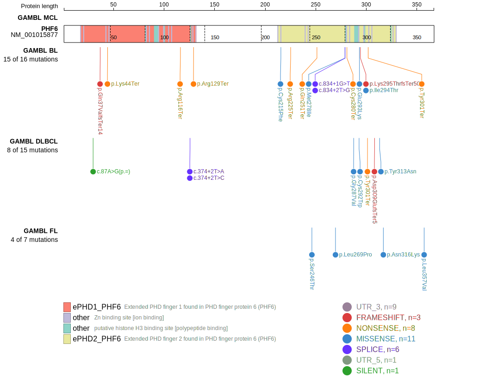
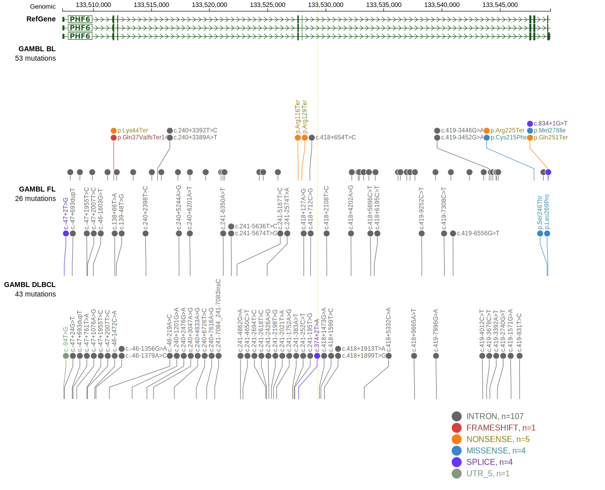

# PHF6

## Relevance tier by entity

|Entity|Tier|Description                              |
|:------:|:----:|-----------------------------------------|
|    |1   |high-confidence BL gene                  |
| |2   |relevance in DLBCL not firmly established|

## Mutation incidence in large patient cohorts (GAMBL reanalysis)

|Entity|source               |frequency (%)|
|:------:|:---------------------:|:-------------:|
|BL    |GAMBL genomes+capture|7.16         |
|BL    |Thomas cohort        |5.50         |
|BL    |Panea cohort         |5.90         |
|DLBCL |GAMBL genomes        |2.49         |
|DLBCL |Schmitz cohort       |1.49         |
|DLBCL |Reddy cohort         |1.40         |
|DLBCL |Chapuy cohort        |0.85         |

## Mutation pattern and selective pressure estimates

|Entity|aSHM|Significant selection|dN/dS (missense)|dN/dS (nonsense)|
|:------:|:----:|:---------------------:|:----------------:|:----------------:|
|BL    |No  |Yes                  |10.853          |196.689         |
|DLBCL |No  |No                   | 6.130          | 36.559         |
|FL    |No  |No                   |31.614          |  0.000         |

> [!NOTE]
> First described in BL in 2023 by [Thomas N](https://pubmed.ncbi.nlm.nih.gov/36201743). First described in DLBCL in 2017 by [Reddy A](https://pubmed.ncbi.nlm.nih.gov/28985567)

View coding variants in ProteinPaint [hg19](https://morinlab.github.io/LLMPP/GAMBL/PHF6_protein.html)  or [hg38](https://morinlab.github.io/LLMPP/GAMBL/PHF6_protein_hg38.html)

View all variants in GenomePaint [hg19](https://morinlab.github.io/LLMPP/GAMBL/PHF6.html)  or [hg38](https://morinlab.github.io/LLMPP/GAMBL/PHF6_hg38.html)

## PHF6 Expression

<!-- ORIGIN: reddyGeneticFunctionalDrivers2017 -->
<!-- BL: thomasGeneticSubgroupsInform2023 -->
<!-- DLBCL: reddyGeneticFunctionalDrivers2017 -->
