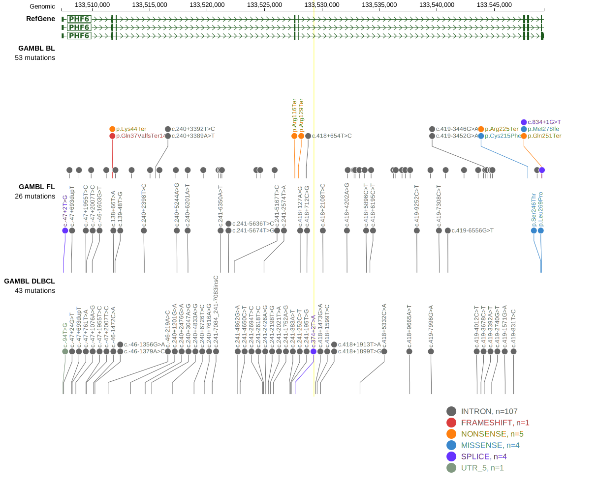

# PHF6

<<Warn("The variants reported in this gene in DLBCL failed QC")>>

## History

## Relevance tier by entity

|Entity|Tier|Description                              |
|:------:|:----:|-----------------------------------------|
|    |1   |high-confidence BL gene                  |
| |2-F   |failed QC|

## Mutation incidence in large patient cohorts (GAMBL reanalysis)

|Entity|source               |frequency (%)|
|:------:|:---------------------:|:-------------:|
|BL    |GAMBL genomes+capture|7.16         |
|BL    |Thomas cohort        |5.50         |
|BL    |Panea cohort         |5.90         |
|DLBCL |GAMBL genomes        |2.49         |
|DLBCL |Schmitz cohort       |1.49         |
|DLBCL |Reddy cohort         |1.40         |
|DLBCL |Chapuy cohort        |0.85         |

## Mutation pattern and selective pressure estimates

|Entity|aSHM|Significant selection|dN/dS (missense)|dN/dS (nonsense)|
|:------:|:----:|:---------------------:|:----------------:|:----------------:|
|BL    |No  |Yes                  |10.853          |196.689         |
|DLBCL |No  |No                   | 6.130          | 36.559         |
|FL    |No  |No                   |31.614          |  0.000         |

View coding variants in ProteinPaint [hg19](https://morinlab.github.io/LLMPP/GAMBL/PHF6_protein.html)  or [hg38](https://morinlab.github.io/LLMPP/GAMBL/PHF6_protein_hg38.html)

View all variants in GenomePaint [hg19](https://morinlab.github.io/LLMPP/GAMBL/PHF6.html)  or [hg38](https://morinlab.github.io/LLMPP/GAMBL/PHF6_hg38.html)

## PHF6 Expression

<!-- ORIGIN: reddyGeneticFunctionalDrivers2017 -->
<!-- BL: thomasGeneticSubgroupsInform2023 -->
<!-- DLBCL: reddyGeneticFunctionalDrivers2017 -->

## All Mutations

[Reddy_2135T](https://www.bcgsc.ca/downloads/morinlab/GAMBL/Reddy/igv_reports/Reddy_2135T.html)
[Reddy_2190T](https://www.bcgsc.ca/downloads/morinlab/GAMBL/Reddy/igv_reports/Reddy_2190T.html)
[Reddy_2191T](https://www.bcgsc.ca/downloads/morinlab/GAMBL/Reddy/igv_reports/Reddy_2191T.html)
[Reddy_2470T](https://www.bcgsc.ca/downloads/morinlab/GAMBL/Reddy/igv_reports/Reddy_2470T.html)
[Reddy_2475T](https://www.bcgsc.ca/downloads/morinlab/GAMBL/Reddy/igv_reports/Reddy_2475T.html)
[Reddy_2482T](https://www.bcgsc.ca/downloads/morinlab/GAMBL/Reddy/igv_reports/Reddy_2482T.html)
[Reddy_2628T](https://www.bcgsc.ca/downloads/morinlab/GAMBL/Reddy/igv_reports/Reddy_2628T.html)
[Reddy_2764T](https://www.bcgsc.ca/downloads/morinlab/GAMBL/Reddy/igv_reports/Reddy_2764T.html)
[Reddy_2778T](https://www.bcgsc.ca/downloads/morinlab/GAMBL/Reddy/igv_reports/Reddy_2778T.html)
[Reddy_2788T](https://www.bcgsc.ca/downloads/morinlab/GAMBL/Reddy/igv_reports/Reddy_2788T.html)
[Reddy_3403T](https://www.bcgsc.ca/downloads/morinlab/GAMBL/Reddy/igv_reports/Reddy_3403T.html)
[Reddy_3422T](https://www.bcgsc.ca/downloads/morinlab/GAMBL/Reddy/igv_reports/Reddy_3422T.html)
[Reddy_3508T](https://www.bcgsc.ca/downloads/morinlab/GAMBL/Reddy/igv_reports/Reddy_3508T.html)
[Reddy_3548T](https://www.bcgsc.ca/downloads/morinlab/GAMBL/Reddy/igv_reports/Reddy_3548T.html)
[Reddy_3557T](https://www.bcgsc.ca/downloads/morinlab/GAMBL/Reddy/igv_reports/Reddy_3557T.html)
[Reddy_3603T](https://www.bcgsc.ca/downloads/morinlab/GAMBL/Reddy/igv_reports/Reddy_3603T.html)
[Reddy_3725T](https://www.bcgsc.ca/downloads/morinlab/GAMBL/Reddy/igv_reports/Reddy_3725T.html)
[Reddy_3955T](https://www.bcgsc.ca/downloads/morinlab/GAMBL/Reddy/igv_reports/Reddy_3955T.html)
[Reddy_823T](https://www.bcgsc.ca/downloads/morinlab/GAMBL/Reddy/igv_reports/Reddy_823T.html)

## References
1.  Reddy A, Zhang J, Davis NS, Moffitt AB, Love CL, Waldrop A, Leppa S, Pasanen A, Meriranta L, Karjalainen-Lindsberg ML, Nørgaard P, Pedersen M, Gang AO, Høgdall E, Heavican TB, Lone W, Iqbal J, Qin Q, Li G, Kim SY, Healy J, Richards KL, Fedoriw Y, Bernal-Mizrachi L, Koff JL, Staton AD, Flowers CR, Paltiel O, Goldschmidt N, Calaminici M, Clear A, Gribben J, Nguyen E, Czader MB, Ondrejka SL, Collie A, Hsi ED, Tse E, Au-Yeung RKH, Kwong YL, Srivastava G, Choi WWL, Evens AM, Pilichowska M, Sengar M, Reddy N, Li S, Chadburn A, Gordon LI, Jaffe ES, Levy S, Rempel R, Tzeng T, Happ LE, Dave T, Rajagopalan D, Datta J, Dunson DB, Dave SS. Genetic and Functional Drivers of Diffuse Large B Cell Lymphoma. Cell. 2017 Oct;171(2):481-494.e15. 
2.  Thomas N, Dreval K, Gerhard DS, Hilton LK, Abramson JS, Ambinder RF, Barta S, Bartlett NL, Bethony J, Bhatia K, Bowen J, Bryan AC, Cesarman E, Casper C, Chadburn A, Cruz M, Dittmer DP, Dyer MA, Farinha P, Gastier-Foster JM, Gerrie AS, Grande BM, Greiner T, Griner NB, Gross TG, Harris NL, Irvin JD, Jaffe ES, Henry D, Huppi R, Leal FE, Lee MS, Martin JP, Martin MR, Mbulaiteye SM, Mitsuyasu R, Morris V, Mullighan CG, Mungall AJ, Mungall K, Mutyaba I, Nokta M, Namirembe C, Noy A, Ogwang MD, Omoding A, Orem J, Ott G, Petrello H, Pittaluga S, Phelan JD, Ramos JC, Ratner L, Reynolds SJ, Rubinstein PG, Sissolak G, Slack G, Soudi S, Swerdlow SH, Traverse-Glehen A, Wilson WH, Wong J, Yarchoan R, ZenKlusen JC, Marra MA, Staudt LM, Scott DW, Morin RD. Genetic subgroups inform on pathobiology in adult and pediatric Burkitt lymphoma. Blood. 2023 Feb 23;141(8):904–916. 
