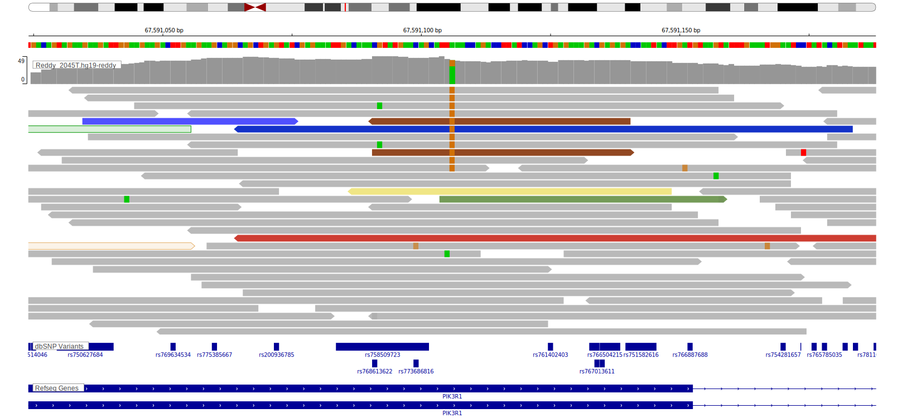
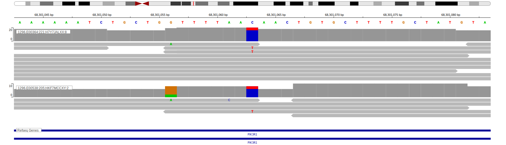

[[_TOC_]]

## Overview

Mutations in this gene were first described in DLBCL in 2013[@zhangGeneticHeterogeneityDiffuse2013] and by the same group in a subsequent study.[@reddyGeneticFunctionalDrivers2017] It remains in Tier 2 because other exome and genome-wide studies of DLBCL did not reproduce this observation. 

## Relevance tier by entity

[[include:tables/table1_PIK3R1.md]]

## Warnings

<<Warn("The variants reported in this gene in BL failed QC")>>

**[See below ](#representative-mutations) or [the study page ](papers/paneaWholeGenomeLandscape2019.md#tier-2) for more information**

## Mutation incidence in large patient cohorts (GAMBL reanalysis)

|Entity|source               |frequency (%)|
|:------:|:---------------------:|:-------------:|
|BL    |GAMBL genomes+capture|3.00         |
|BL    |Thomas cohort        |2.50         |
|BL    |Panea cohort         |4.00         |
|DLBCL |GAMBL genomes        |1.91         |
|DLBCL |Schmitz cohort       |2.13         |
|DLBCL |Reddy cohort         |2.00         |
|DLBCL |Chapuy cohort        |4.70         |

## Mutation pattern and selective pressure estimates

[[include:tables/dnds_PIK3R1.md]]

[[include:browser_PIK3R1.md]]

## Expression

<!-- ORIGIN: zhangGeneticHeterogeneityDiffuse2013 -->
<!-- DLBCL: zhangGeneticHeterogeneityDiffuse2013 -->
<!-- BL: paneaWholeGenomeLandscape2019 -->

## Representative Mutations

### DLBCL[@zhangGeneticHeterogeneityDiffuse2013]

**Rating**
&starf; &starf; &starf; &star; &star;

### BL[@paneaWholeGenomeLandscape2019]

**Rating**
&starf; &star; &star; &star; &star;

**Rating**
&starf; &star; &star; &star; &star;

[[include:tables/mermaid_PIK3R1.md]]

## References

