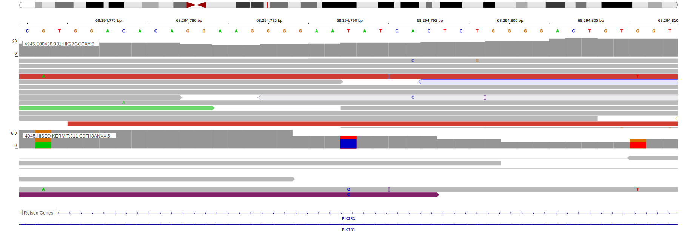

# PIK3R1

<<Warn("The variants reported in this gene in BL failed QC")>>

**[See below ](#representative-mutations) or [the study page ](papers/paneaWholeGenomeLandscape2019.md#tier-2) for more information**

## History

## Relevance tier by entity

|Entity|Tier|Description                              |
|:------:|:----:|-----------------------------------------|
|    |2-F |Failed QC[@paneaWholeGenomeLandscape2019]|
| |2   |relevance in DLBCL not firmly established[@zhangGeneticHeterogeneityDiffuse2013]|

## Mutation incidence in large patient cohorts (GAMBL reanalysis)

|Entity|source               |frequency (%)|
|:------:|:---------------------:|:-------------:|
|BL    |GAMBL genomes+capture|3.00         |
|BL    |Thomas cohort        |2.50         |
|BL    |Panea cohort         |4.00         |
|DLBCL |GAMBL genomes        |1.91         |
|DLBCL |Schmitz cohort       |2.13         |
|DLBCL |Reddy cohort         |2.00         |
|DLBCL |Chapuy cohort        |4.70         |

## Mutation pattern and selective pressure estimates

|Entity|aSHM|Significant selection|dN/dS (missense)|dN/dS (nonsense)|
|:------:|:----:|:---------------------:|:----------------:|:----------------:|
|BL    |No  |No                   |3.917           | 0.000          |
|DLBCL |No  |No                   |2.158           |16.154          |
|FL    |No  |No                   |0.000           |14.389          |

View coding variants in ProteinPaint [hg19](https://morinlab.github.io/LLMPP/GAMBL/PIK3R1_protein.html)  or [hg38](https://morinlab.github.io/LLMPP/GAMBL/PIK3R1_protein_hg38.html)

View all variants in GenomePaint [hg19](https://morinlab.github.io/LLMPP/GAMBL/PIK3R1.html)  or [hg38](https://morinlab.github.io/LLMPP/GAMBL/PIK3R1_hg38.html)

## PIK3R1 Expression

<!-- ORIGIN: zhangGeneticHeterogeneityDiffuse2013 -->
<!-- DLBCL: zhangGeneticHeterogeneityDiffuse2013 -->
<!-- BL: paneaWholeGenomeLandscape2019 -->

## Representative Mutations

### DLBCL1

**Rating**
&starf; &starf; &starf; &star; &star;

### BL2

**Rating**
&starf; &star; &star; &star; &star;

**Rating**
&starf; &star; &star; &star; &star;

## References

