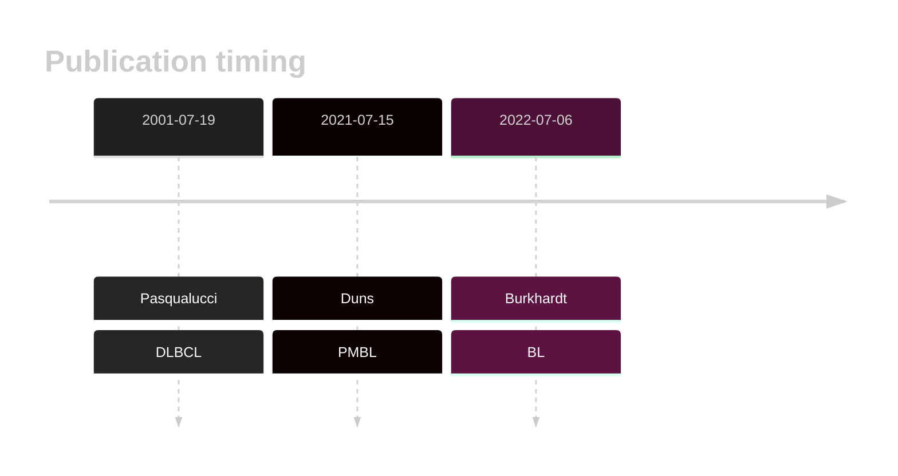

# PIM1

## Overview
PIM1 is one of [a number of genes](https://github.com/morinlab/LLMPP/wiki/ashm) affected by aberrant somatic hypermutation in B-cell lymphomas, which complicates the interpretation of mutations at this locus.
## History

## Relevance tier by entity

|Entity|Tier|Description                           |
|:------:|:----:|--------------------------------------|
||1|high-confidence PMBL/cHL/GZL gene|
|    |2-a | aSHM target; Although recurrent, the relevance of mutations in BL is tenuous |
| |1-a | aSHM target and high-confidence DLBCL gene            |
|    |1-a | aSHM target and high-confidence FL gene               |

## Mutation incidence in large patient cohorts (GAMBL reanalysis)

|Entity|source               |frequency (%)|
|:------:|:---------------------:|:-------------:|
|BL    |GAMBL genomes+capture| 2.31        |
|BL    |Thomas cohort        |   NA        |
|BL    |Panea cohort         |   NA        |
|DLBCL |GAMBL genomes        |20.27        |
|DLBCL |Schmitz cohort       |27.66        |
|DLBCL |Reddy cohort         |19.12        |
|DLBCL |Chapuy cohort        |23.93        |
|FL    |GAMBL genomes        | 9.24        |

## Mutation pattern and selective pressure estimates

|Entity|aSHM|Significant selection|dN/dS (missense)|dN/dS (nonsense)|
|:------:|:----:|:---------------------:|:----------------:|:----------------:|
|BL    |Yes |No                   |6.021           |0.000           |
|DLBCL |Yes |Yes                  |2.096           |2.418           |
|FL    |Yes |No                   |4.214           |0.000           |

## aSHM regions

|chr_name|hg19_start|hg19_end|region                                                                                   |regulatory_comment|
|:--------:|:----------:|:--------:|:-----------------------------------------------------------------------------------------:|:------------------:|
|chr6    |37138104  |37139804|[TSS](https://genome.ucsc.edu/s/rdmorin/GAMBL%20hg19?position=chr6%3A37138104%2D37139804)|active_promoter   |

## PIM1 Hotspots

| Chromosome |Coordinate (hg19) | ref>alt | HGVSp | 
 | :---:| :---: | :--: | :---: |
| chr6 | 37138406 | G>A | D19N |
| chr6 | 37138419 | C>G | T23S |
| chr6 | 37138423 | G>C | K24N |
| chr6 | 37138423 | G>T | K24N |
| chr6 | 37138427 | G>A | A26T |
| chr6 | 37138430 | C>A | P27T |
| chr6 | 37138549 | G>A | G28D |
| chr6 | 37138554 | G>A | E30K |
| chr6 | 37138560 | G>A | E32K |
| chr6 | 37138563 | C>T | P33S |
| chr6 | 37138566 | C>G | L34V |
| chr6 | 37138573 | C>T | S36L |
| chr6 | 37138576 | AG>TA | Q37L |
| chr6 | 37138577 | G>C | Q37H |
| chr6 | 37138583 | G>C | Q39H |
| chr6 | 37138593 | C>G | L43V |
| chr6 | 37138596 | C>A | L44M |
| chr6 | 37138596 | C>G | L44V |
| chr6 | 37138603 | GCG>- | G48del |
| chr6 | 37138604 | C>A | S46R |

View coding variants in ProteinPaint [hg19](https://morinlab.github.io/LLMPP/GAMBL/PIM1_protein.html)  or [hg38](https://morinlab.github.io/LLMPP/GAMBL/PIM1_protein_hg38.html)

View all variants in GenomePaint [hg19](https://morinlab.github.io/LLMPP/GAMBL/PIM1.html)  or [hg38](https://morinlab.github.io/LLMPP/GAMBL/PIM1_hg38.html)

## PIM1 Expression

<!-- ORIGIN: pasqualucciHypermutationMultipleProtooncogenes2001a -->
<!-- BL: burkhardtClinicalRelevanceMolecular2022b -->
<!-- BL: burkhardtClinicalRelevanceMolecular2022b -->
<!-- DLBCL: pasqualucciHypermutationMultipleProtooncogenes2001a -->

## References
1.  Pasqualucci L, Neumeister P, Goossens T, Nanjangud G, Chaganti RS, Küppers R, Dalla-Favera R. Hypermutation of multiple proto-oncogenes in B-cell diffuse large-cell lymphomas. Nature. 2001 Jul 19;412(6844):341–346. PMID: 11460166
2.  Duns G, Viganò E, Ennishi D, Sarkozy C, Hung SS, Chavez E, Takata K, Rushton C, Jiang A, Ben-Neriah S, Woolcock BW, Slack GW, Hsi ED, Craig JW, Hilton LK, Shah SP, Farinha P, Mottok A, Gascoyne RD, Morin RD, Savage KJ, Scott DW, Steidl C. Characterization of DLBCL with a PMBL gene expression signature. Blood. 2021 Jul 15;138(2):136–148. PMID: 33684939
3.  Burkhardt B, Michgehl U, Rohde J, Erdmann T, Berning P, Reutter K, Rohde M, Borkhardt A, Burmeister T, Dave S, Tzankov A, Dugas M, Sandmann S, Fend F, Finger J, Mueller S, Gökbuget N, Haferlach T, Kern W, Hartmann W, Klapper W, Oschlies I, Richter J, Kontny U, Lutz M, Maecker-Kolhoff B, Ott G, Rosenwald A, Siebert R, von Stackelberg A, Strahm B, Woessmann W, Zimmermann M, Zapukhlyak M, Grau M, Lenz G. Clinical relevance of molecular characteristics in Burkitt lymphoma differs according to age. Nat Commun. 2022 Jul 6;13(1):3881. PMCID: PMC9259584
<!-- PMBL: dunsCharacterizationDLBCLPMBL2021b -->
