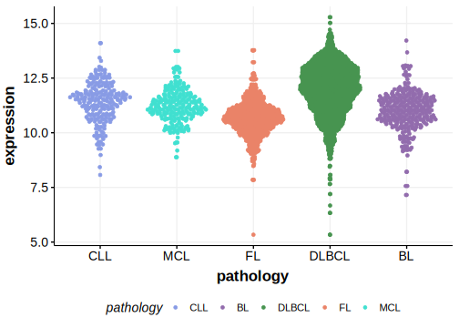

[[_TOC_]]

## Overview
PIM1 is one of [a number of genes](https://github.com/morinlab/LLMPP/wiki/ashm) affected by aberrant somatic hypermutation in B-cell lymphomas, which complicates the interpretation of mutations at this locus.

## Experimental Evidence

Driver mutations affecting this gene in FL/DLBCL have been experimentally demonstrated to cause a gain of function (GOF).[@kuoRolePIM1Ibrutinibresistant2016]

## Relevance tier by entity

[[include:tables/table1_PIM1.md]]

## Mutation incidence in large patient cohorts (GAMBL reanalysis)

### DLBCL
[[include:tables/DLBCL_PIM1.md]]

### FL
[[include:tables/FL_PIM1.md]]

### BL
[[include:tables/BL_PIM1.md]]

## Mutation pattern and selective pressure estimates

[[include:tables/dnds_PIM1.md]]

## aSHM regions

[[include:ashm_PIM1.md]]

## PIM1 Hotspots

| Chromosome |Coordinate (hg19) | ref>alt | HGVSp | 
 | :---:| :---: | :--: | :---: |
| chr6 | 37138406 | G>A | D19N |
| chr6 | 37138419 | C>G | T23S |
| chr6 | 37138423 | G>C | K24N |
| chr6 | 37138423 | G>T | K24N |
| chr6 | 37138427 | G>A | A26T |
| chr6 | 37138430 | C>A | P27T |
| chr6 | 37138549 | G>A | G28D |
| chr6 | 37138554 | G>A | E30K |
| chr6 | 37138560 | G>A | E32K |
| chr6 | 37138563 | C>T | P33S |
| chr6 | 37138566 | C>G | L34V |
| chr6 | 37138573 | C>T | S36L |
| chr6 | 37138576 | AG>TA | Q37L |
| chr6 | 37138577 | G>C | Q37H |
| chr6 | 37138583 | G>C | Q39H |
| chr6 | 37138593 | C>G | L43V |
| chr6 | 37138596 | C>A | L44M |
| chr6 | 37138596 | C>G | L44V |
| chr6 | 37138603 | GCG>- | G48del |
| chr6 | 37138604 | C>A | S46R |

[[include:browser_PIM1.md]]

## Expression

<!-- ORIGIN: pasqualucciHypermutationMultipleProtooncogenes2001a -->
## Experimental Evidence

Driver mutations affecting this gene in FL/DLBCL have been experimentally demonstrated to cause a gain of function (GOF).[@kuoRolePIM1Ibrutinibresistant2016]

<!-- BL: burkhardtClinicalRelevanceMolecular2022b -->
## Experimental Evidence

Driver mutations affecting this gene in FL/DLBCL have been experimentally demonstrated to cause a gain of function (GOF).[@kuoRolePIM1Ibrutinibresistant2016]

<!-- BL: burkhardtClinicalRelevanceMolecular2022b -->
<!-- DLBCL: pasqualucciHypermutationMultipleProtooncogenes2001a -->

[[include:tables/mermaid_PIM1.md]]

## References

<!-- PMBL: dunsCharacterizationDLBCLPMBL2021b -->
