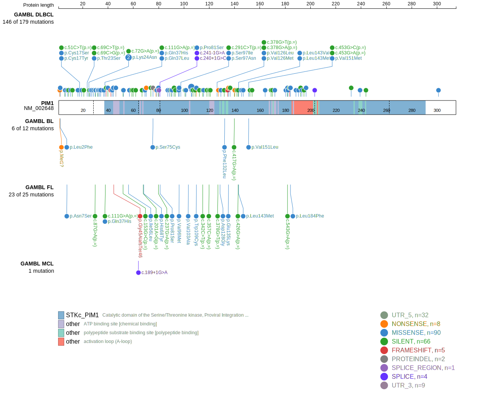
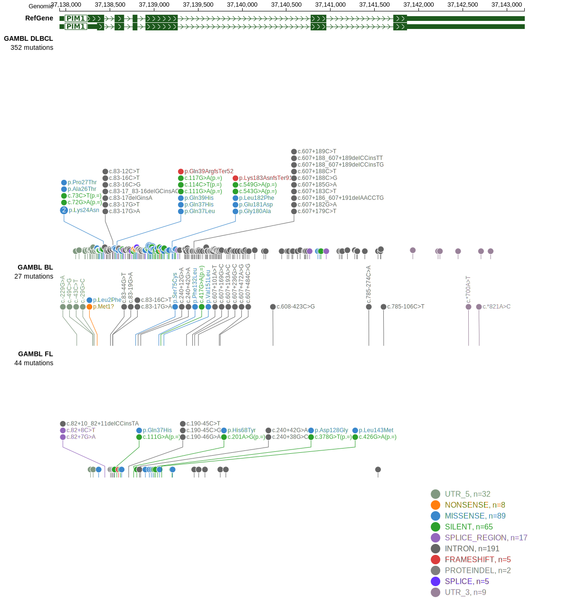

# [PIM1]

## Mutation tier

|Entity|Tier|Description                           |
|:------:|:----:|--------------------------------------|
|BL    |2   |relevance in BL not firmly established|
|DLBCL |1   |high-confidence DLBCL gene            |
|FL    |1   |high-confidence FL gene               |
## Mutation incidence

|Entity|source               |frequency (%)|
|:------:|:---------------------:|:-------------:|
|BL    |GAMBL genomes+capture| 2.31        |
|BL    |Thomas cohort        |   NA        |
|BL    |Panea cohort         |   NA        |
|DLBCL |GAMBL genomes        |20.27        |
|DLBCL |Schmitz cohort       |27.70        |
|DLBCL |Reddy cohort         |19.10        |
|DLBCL |Chapuy cohort        |23.90        |
|FL    |GAMBL genomes        | 9.24        |

## Mutation pattern

|Entity|aSHM|Significant selection|dN/dS (missense)|dN/dS (nonsense)|
|:------:|:----:|:---------------------:|:----------------:|:----------------:|
|BL    |Yes |No                   |6.021           |0.000           |
|DLBCL |Yes |Yes                  |2.096           |2.418           |
|FL    |Yes |No                   |4.214           |0.000           |

## aSHM regions

|chr_name|hg19_start|hg19_end|region                                                                                   |regulatory_comment|
|:--------:|:----------:|:--------:|:-----------------------------------------------------------------------------------------:|:------------------:|
|chr6    |37138104  |37139804|[TSS](https://genome.ucsc.edu/s/rdmorin/GAMBL%20hg19?position=chr6%3A37138104%2D37139804)|active_promoter   |

> [!NOTE]
> First described in BL in 2022 by [Burkhardt B](https://pubmed.ncbi.nlm.nih.gov/35794096). First described in DLBCL in 2001 by [Pasqualucci L](https://pubmed.ncbi.nlm.nih.gov/11460166)

 ## PIM1 Hotspots

| Chromosome |Coordinate (hg19) | ref>alt | HGVSp | 
 | :---:| :---: | :--: | :---: |
| chr6 | 37138406 | G>A | D19N |
| chr6 | 37138419 | C>G | T23S |
| chr6 | 37138423 | G>C | K24N |
| chr6 | 37138423 | G>T | K24N |
| chr6 | 37138427 | G>A | A26T |
| chr6 | 37138430 | C>A | P27T |
| chr6 | 37138549 | G>A | G28D |
| chr6 | 37138554 | G>A | E30K |
| chr6 | 37138560 | G>A | E32K |
| chr6 | 37138563 | C>T | P33S |
| chr6 | 37138566 | C>G | L34V |
| chr6 | 37138573 | C>T | S36L |
| chr6 | 37138576 | AG>TA | Q37L |
| chr6 | 37138577 | G>C | Q37H |
| chr6 | 37138583 | G>C | Q39H |
| chr6 | 37138593 | C>G | L43V |
| chr6 | 37138596 | C>A | L44M |
| chr6 | 37138596 | C>G | L44V |
| chr6 | 37138603 | GCG>- | G48del |
| chr6 | 37138604 | C>A | S46R |

View coding variants in ProteinPaint [hg19](https://www.bcgsc.ca/downloads/morinlab/GAMBL/test/genes/PIM1_protein.html)  or [hg38](https://www.bcgsc.ca/downloads/morinlab/GAMBL/test/genes/PIM1_protein_hg38.html)

View all variants in GenomePaint [hg19](https://www.bcgsc.ca/downloads/morinlab/GAMBL/test/genes/PIM1.html)  or [hg38](https://www.bcgsc.ca/downloads/morinlab/GAMBL/test/genes/PIM1_hg38.html)

