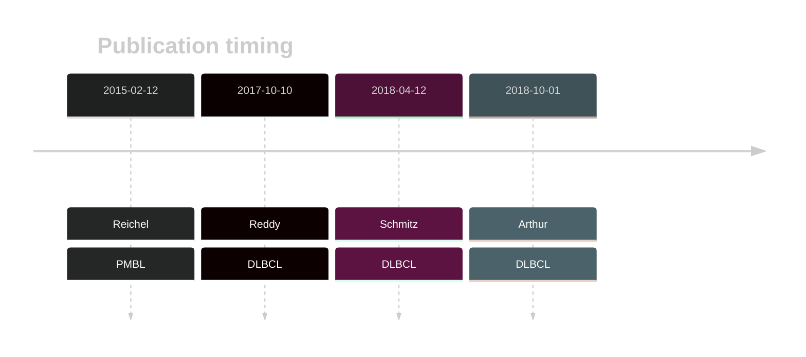
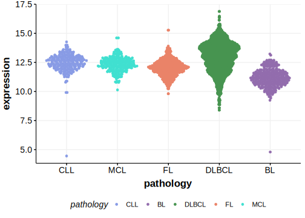

# PIM2

## Overview
PIM2 is one of [a number of genes](https://github.com/morinlab/LLMPP/wiki/ashm) affected by aberrant somatic hypermutation in B-cell lymphomas, which complicates the interpretation of mutations at this locus.

## History

## Relevance tier by entity

|Entity|Tier|Description               |
|:------:|:----:|--------------------------|
||1|high-confidence PMBL/cHL/GZL gene[@reichelFlowSortingExome2015a]|
| |1 | aSHM target and high-confidence DLBCL gene[@reddyGeneticFunctionalDrivers2017; @schmitzGeneticsPathogenesisDiffuse2018a; @arthurGenomewideDiscoverySomatic2018]|

## Mutation incidence in large patient cohorts (GAMBL reanalysis)

|Entity|source        |frequency (%)|
|:------:|:--------------:|:-------------:|
|DLBCL |GAMBL genomes |3.44         |
|DLBCL |Schmitz cohort|6.38         |
|DLBCL |Reddy cohort  |4.00         |
|DLBCL |Chapuy cohort |3.85         |

## Mutation pattern and selective pressure estimates

|Entity|aSHM|Significant selection|dN/dS (missense)|dN/dS (nonsense)|
|:------:|:----:|:---------------------:|:----------------:|:----------------:|
|BL    |Yes |No                   |0.000           | 0.000          |
|DLBCL |Yes |No                   |1.908           |14.378          |
|FL    |Yes |No                   |0.000           |62.405          |

## aSHM regions

|chr_name|hg19_start|hg19_end|region                                                                                   |regulatory_comment|
|:--------:|:----------:|:--------:|:-----------------------------------------------------------------------------------------:|:------------------:|
|chrX    |48774756  |48776255|[TSS](https://genome.ucsc.edu/s/rdmorin/GAMBL%20hg19?position=chrX%3A48774756%2D48776255)|active_promoter   |

View coding variants in ProteinPaint [hg19](https://morinlab.github.io/LLMPP/GAMBL/PIM2_protein.html)  or [hg38](https://morinlab.github.io/LLMPP/GAMBL/PIM2_protein_hg38.html)

View all variants in GenomePaint [hg19](https://morinlab.github.io/LLMPP/GAMBL/PIM2.html)  or [hg38](https://morinlab.github.io/LLMPP/GAMBL/PIM2_hg38.html)

## PIM2 Expression

<!-- ORIGIN: reichelFlowSortingExome2015a -->
<!-- DLBCL: arthurGenomewideDiscoverySomatic2018 -->
<!-- PMBL: reichelFlowSortingExome2015a -->

## References
