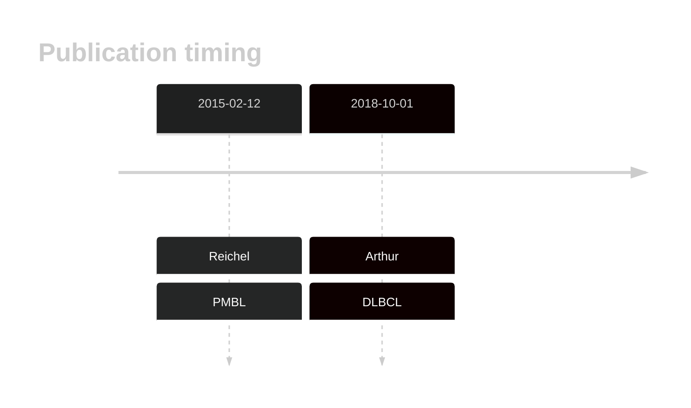
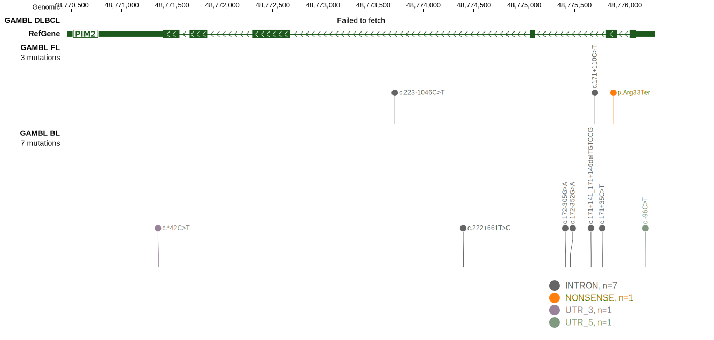

# PIM2

## Overview
PIM2 is one of [a number of genes](https://github.com/morinlab/LLMPP/wiki/ashm) affected by aberrant somatic hypermutation in B-cell lymphomas, which complicates the interpretation of mutations at this locus.

## History

## Relevance tier by entity

|Entity|Tier|Description               |
|:------:|:----:|--------------------------|
||1|high-confidence PMBL/cHL/GZL gene|
| |1-a | aSHM target and high-confidence DLBCL gene|

## Mutation incidence in large patient cohorts (GAMBL reanalysis)

|Entity|source        |frequency (%)|
|:------:|:--------------:|:-------------:|
|DLBCL |GAMBL genomes |3.44         |
|DLBCL |Schmitz cohort|6.38         |
|DLBCL |Reddy cohort  |4.00         |
|DLBCL |Chapuy cohort |3.85         |

## Mutation pattern and selective pressure estimates

|Entity|aSHM|Significant selection|dN/dS (missense)|dN/dS (nonsense)|
|:------:|:----:|:---------------------:|:----------------:|:----------------:|
|BL    |Yes |No                   |0.000           | 0.000          |
|DLBCL |Yes |No                   |1.908           |14.378          |
|FL    |Yes |No                   |0.000           |62.405          |

## aSHM regions

|chr_name|hg19_start|hg19_end|region                                                                                   |regulatory_comment|
|:--------:|:----------:|:--------:|:-----------------------------------------------------------------------------------------:|:------------------:|
|chrX    |48774756  |48776255|[TSS](https://genome.ucsc.edu/s/rdmorin/GAMBL%20hg19?position=chrX%3A48774756%2D48776255)|active_promoter   |

View coding variants in ProteinPaint [hg19](https://morinlab.github.io/LLMPP/GAMBL/PIM2_protein.html)  or [hg38](https://morinlab.github.io/LLMPP/GAMBL/PIM2_protein_hg38.html)

View all variants in GenomePaint [hg19](https://morinlab.github.io/LLMPP/GAMBL/PIM2.html)  or [hg38](https://morinlab.github.io/LLMPP/GAMBL/PIM2_hg38.html)

## PIM2 Expression

<!-- ORIGIN: reichelFlowSortingExome2015a -->
<!-- DLBCL: arthurGenomewideDiscoverySomatic2018 -->
<!-- PMBL: reichelFlowSortingExome2015a -->

## References
1.  Reichel J, Chadburn A, Rubinstein PG, Giulino-Roth L, Tam W, Liu Y, Gaiolla R, Eng K, Brody J, Inghirami G, Carlo-Stella C, Santoro A, Rahal D, Totonchy J, Elemento O, Cesarman E, Roshal M. Flow sorting and exome sequencing reveal the oncogenome of primary Hodgkin and Reed-Sternberg cells. Blood. 2015 Feb 12;125(7):1061–1072. PMID: 25488972
2.  Arthur SE, Jiang A, Grande BM, Alcaide M, Cojocaru R, Rushton CK, Mottok A, Hilton LK, Lat PK, Zhao EY, Culibrk L, Ennishi D, Jessa S, Chong L, Thomas N, Pararajalingam P, Meissner B, Boyle M, Davidson J, Bushell KR, Lai D, Farinha P, Slack GW, Morin GB, Shah S, Sen D, Jones SJM, Mungall AJ, Gascoyne RD, Audas TE, Unrau P, Marra MA, Connors JM, Steidl C, Scott DW, Morin RD. Genome-wide discovery of somatic regulatory variants in diffuse large B-cell lymphoma. Nat Commun. 2018 Oct 1;9(1):4001. PMCID: PMC6167379
