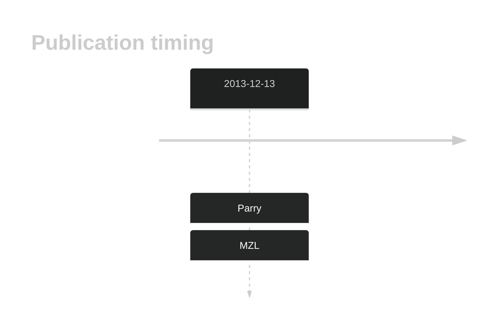

# PLA2G4D

## History

## Relevance tier by entity

|Entity|Tier|Description|
|:------:|:----:|--------------------------------------|
||2|relevance in MZL not firmly established[@parryWholeExomeSequencing2013]|

## Mutation incidence in large patient cohorts (GAMBL reanalysis)

|Entity|source |frequency (%)|
|:------:|:----:|:----:|
|BL|GAMBL Exome |1.149 |
|BL|GAMBL Genome |1.544 |
|DLBCL|GAMBL Exome |1.402 |
|DLBCL|GAMBL Genome |0.752 |
|MCL|GAMBL Genome |1.17 |

## References

