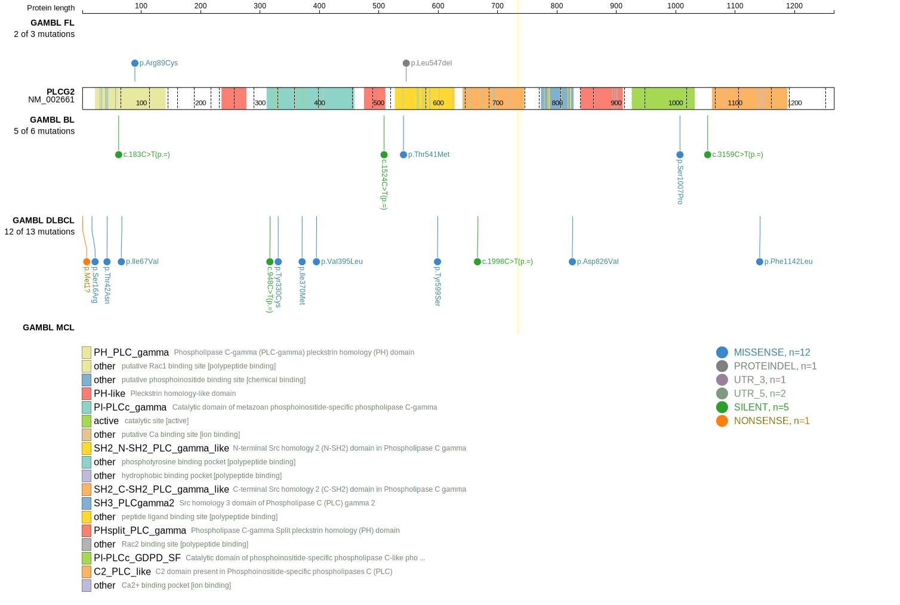
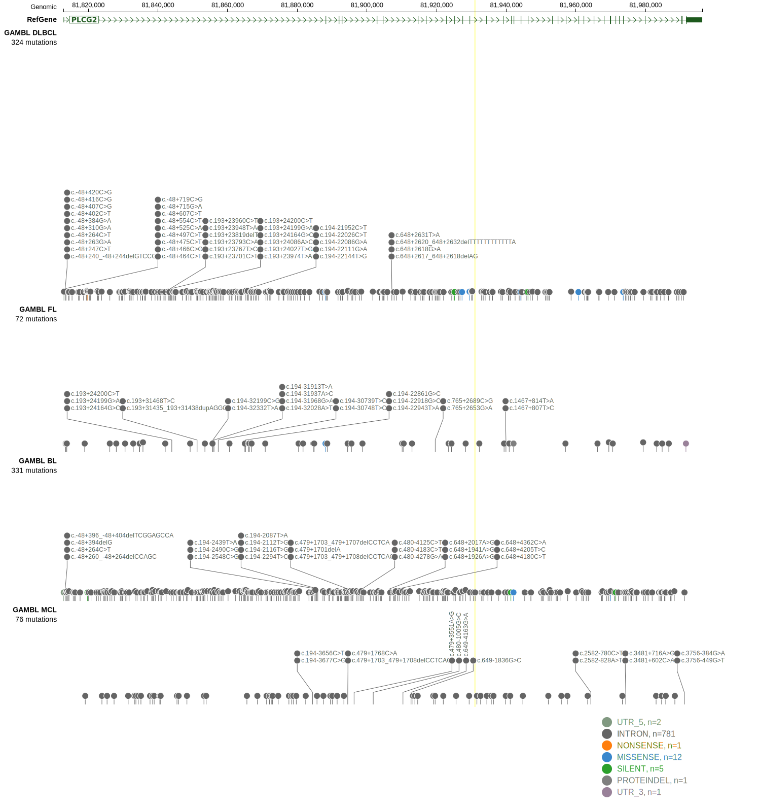
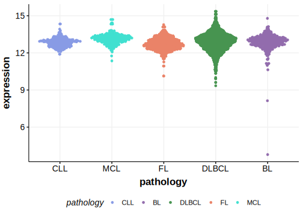

[[_TOC_]]

## Relevance tier by entity

|Entity|Tier|Description                           |
|:------:|:----:|--------------------------------------|
|    |2   |relevance in BL not firmly established[@paneaWholeGenomeLandscape2019]|

## Mutation incidence in large patient cohorts (GAMBL reanalysis)

|Entity|source               |frequency (%)|
|:------:|:---------------------:|:-------------:|
|BL    |GAMBL genomes+capture| 3.0         |
|BL    |Thomas cohort        | 0.8         |
|BL    |Panea cohort         |10.9         |

## Mutation pattern and selective pressure estimates

|Entity|aSHM|Significant selection|dN/dS (missense)|dN/dS (nonsense)|
|:------:|:----:|:---------------------:|:----------------:|:----------------:|
|BL    |No  |No                   |0.800           | 0.000          |
|DLBCL |No  |No                   |2.213           |14.094          |
|FL    |No  |No                   |1.491           | 0.000          |

## PLCG2 Hotspots

| Chromosome |Coordinate (hg19) | ref>alt | HGVSp | 
 | :---:| :---: | :--: | :---: |
| chr16 | 81819719 | C>A | T42N |

View coding variants in ProteinPaint [hg19](https://morinlab.github.io/LLMPP/GAMBL/PLCG2_protein.html)  or [hg38](https://morinlab.github.io/LLMPP/GAMBL/PLCG2_protein_hg38.html)

View all variants in GenomePaint [hg19](https://morinlab.github.io/LLMPP/GAMBL/PLCG2.html)  or [hg38](https://morinlab.github.io/LLMPP/GAMBL/PLCG2_hg38.html)

## PLCG2 Expression

<!-- ORIGIN: paneaWholeGenomeLandscape2019 -->
<!-- BL: paneaWholeGenomeLandscape2019 -->

[[include:mermaid_PLCG2.md]]

## References
