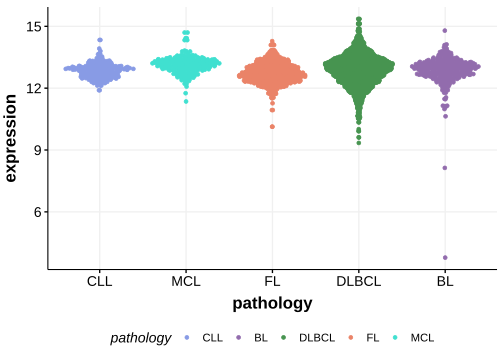

[[_TOC_]]

## Relevance tier by entity

[[include:tables/table1_PLCG2.md]]

## Mutation incidence in large patient cohorts (GAMBL reanalysis)

### BL
[[include:tables/BL_PLCG2.md]]

### DLBCL
[[include:tables/DLBCL_PLCG2.md]]

### FL
[[include:tables/FL_PLCG2.md]]

## Mutation pattern and selective pressure estimates

[[include:tables/dnds_PLCG2.md]]

## PLCG2 Hotspots

| Chromosome |Coordinate (hg19) | ref>alt | HGVSp | 
 | :---:| :---: | :--: | :---: |
| chr16 | 81819719 | C>A | T42N |

[[include:tables/browser_PLCG2.md]]

## Expression

<!-- ORIGIN: paneaWholeGenomeLandscape2019 -->
<!-- BL: paneaWholeGenomeLandscape2019 -->

[[include:tables/mermaid_PLCG2.md]]

## References
