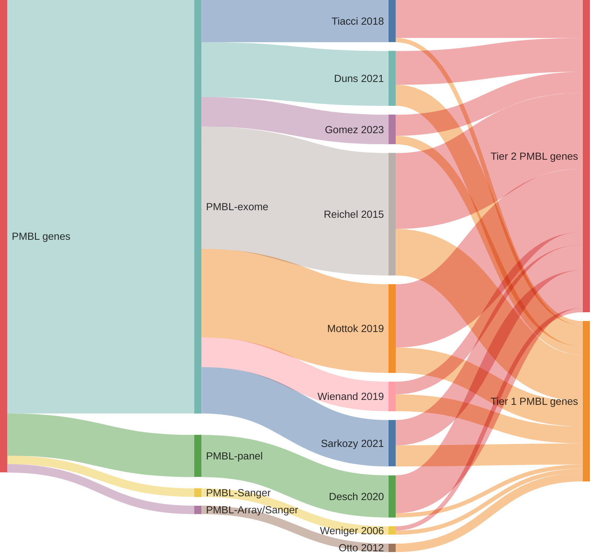

## Origins of PMBL genes

## Tier 1 PMBL genes

### *76 total*

|Gene|Tier| First PMBL evidence | Other entities |
|:-:|:-:|:-|:-|
|[ACTB](ACTB)|1|[@wienandGenomicAnalysesFlowsorted2019b]|[@lohrDiscoveryPrioritizationSomatic2012a]|
|[ARID1A](ARID1A)|1|[@wienandGenomicAnalysesFlowsorted2019b]|[@rossiCodingGenomeSplenic2012c; @zhangGeneticHeterogeneityDiffuse2013; @loveGeneticLandscapeMutations2012; @krysiakRecurrentSomaticMutations2017b]|
|[ARID5B](ARID5B)|1|[@gomezUltraDeepSequencingReveals2023]|[@reddyGeneticFunctionalDrivers2017]|
|[B2M](B2M)|1|[@reichelFlowSortingExome2015a]|[@pararajalingamCodingNoncodingDrivers2020; @morinFrequentMutationHistonemodifying2011]|
|[BIRC6](BIRC6)|1|[@sarkozyMutationalLandscapeGray2021a]|[@reddyGeneticFunctionalDrivers2017]|
|[BTG1](BTG1)|1|[@sarkozyMutationalLandscapeGray2021a]|[@burkhardtClinicalRelevanceMolecular2022b; @morinFrequentMutationHistonemodifying2011]|
|[CD58](CD58)|1|[@schneiderAlterationsCD58Gene2015a]|[@morinFrequentMutationHistonemodifying2011]|
|[CD83](CD83)|1|[@dunsCharacterizationDLBCLPMBL2021b]|[@morinMutationalStructuralAnalysis2013; @russler-germainMutationsAssociatedProgression2023b; @paneaWholeGenomeLandscape2019]|
|[CDKN2A](CDKN2A)|1||[@spinaGeneticsNodalMarginal2016b; @morinMutationalStructuralAnalysis2013; @grandeGenomewideDiscoverySomatic2019]|
|[CHD8](CHD8)|1||[@grandeGenomewideDiscoverySomatic2019; @reddyGeneticFunctionalDrivers2017]|
|[CIITA](CIITA)|1|[@mottokGenomicAlterationsCIITA2015b]|[@morinFrequentMutationHistonemodifying2011]|
|[CISH](CISH)|1|[@mottokIntegrativeGenomicAnalysis2019b]||
|[CREBBP](CREBBP)|1|[@dunsCharacterizationDLBCLPMBL2021b]|[@pasqualucciInactivatingMutationsAcetyltransferase2011a; @loveGeneticLandscapeMutations2012; @parryWholeExomeSequencing2013]|
|[CSF2RB](CSF2RB)|1|[@reichelFlowSortingExome2015a]||
|[DDX3X](DDX3X)|1|[@mottokIntegrativeGenomicAnalysis2019b]|[@schmitzBurkittLymphomaPathogenesis2012; @schmitzGeneticsPathogenesisDiffuse2018a]|
|[DTX1](DTX1)|1|[@gomezUltraDeepSequencingReveals2023]|[@schmitzGeneticsPathogenesisDiffuse2018a; @paneaWholeGenomeLandscape2019; @rossiCodingGenomeSplenic2012c]|
|[DUSP2](DUSP2)|1|[@dunsCharacterizationDLBCLPMBL2021b]|[@morinMutationalStructuralAnalysis2013]|
|[EBF1](EBF1)|1|[@reichelFlowSortingExome2015a]|[@thomasGeneticSubgroupsInform2023; @bohleRoleEarlyBcell2013]|
|[EEF1A1](EEF1A1)|1|[@reichelFlowSortingExome2015a]|[@hubschmannMutationalMechanismsShaping2021b]|
|[ETS1](ETS1)|1||[@paneaWholeGenomeLandscape2019; @morinFrequentMutationHistonemodifying2011]|
|[EWSR1](EWSR1)|1||[@pararajalingamCodingNoncodingDrivers2020]|
|[EZH2](EZH2)|1|[@mottokIntegrativeGenomicAnalysis2019b]|[@morinSomaticMutationsAltering2010a; @loveGeneticLandscapeMutations2012]|
|[FAS](FAS)|1||[@spinaGeneticsNodalMarginal2016b; @schollMutationsRegionFAS2007]|
|[FAT1](FAT1)|1||[@spinaGeneticsNodalMarginal2016b]|
|[FAT4](FAT4)|1||[@zhangGenomicLandscapeMantle2014; @morinMutationalStructuralAnalysis2013; @parryWholeExomeSequencing2013]|
|[GNA13](GNA13)|1|[@reichelFlowSortingExome2015a]|[@morinFrequentMutationHistonemodifying2011; @loveGeneticLandscapeMutations2012]|
|[HIST1H1B](HIST1H1B)|1|[@sarkozyMutationalLandscapeGray2021a]|[@chapuyMolecularSubtypesDiffuse2018b; @krysiakRecurrentSomaticMutations2017b]|
|[HIST1H1C](HIST1H1C)|1||[@morinFrequentMutationHistonemodifying2011; @paneaWholeGenomeLandscape2019]|
|[HIST1H1D](HIST1H1D)|1||[@krysiakRecurrentSomaticMutations2017b; @morinMutationalStructuralAnalysis2013; @jalladesExomeSequencingIdentifies2017]|
|[HIST1H1E](HIST1H1E)|1|[@reichelFlowSortingExome2015a]|[@grandeGenomewideDiscoverySomatic2019; @morinMutationalStructuralAnalysis2013; @krysiakRecurrentSomaticMutations2017b]|
|[HLA-B](HLA-B)|1|[@wienandGenomicAnalysesFlowsorted2019b]||
|[IL4R](IL4R)|1|[@viganoSomaticIL4RMutations2018b]|[@dunsCharacterizationDLBCLPMBL2021b]|
|[IRF8](IRF8)|1|[@mottokIntegrativeGenomicAnalysis2019b]|[@paneaWholeGenomeLandscape2019; @morinFrequentMutationHistonemodifying2011]|
|[ITPKB](ITPKB)|1|[@reichelFlowSortingExome2015a]|[@schmitzGeneticsPathogenesisDiffuse2018a]|
|[JAK1](JAK1)|1|[@mottokIntegrativeGenomicAnalysis2019b]|[@zhangGeneticHeterogeneityDiffuse2013]|
|[KMT2C](KMT2C)|1|[@sarkozyMutationalLandscapeGray2021a]|[@zhouSporadicEndemicBurkitt2019; @zhangGeneticHeterogeneityDiffuse2013; @zhangGenomicLandscapeMantle2014]|
|[LTB](LTB)|1|[@deschGenotypingCirculatingTumor2020]|[@chapuyMolecularSubtypesDiffuse2018b; @paneaWholeGenomeLandscape2019]|
|[MAP3K14](MAP3K14)|1|[@ottoGeneticLesionsTRAF32012a]|[@rossiAlterationBIRC3Multiple2011a]|
|[MS4A1](MS4A1)|1|[@mottokIntegrativeGenomicAnalysis2019b]|[@rushtonGeneticEvolutionaryPatterns2020]|
|[NFKBIA](NFKBIA)|1|[@wienandGenomicAnalysesFlowsorted2019b]|[@lakeMutationsNFKBIAEncoding2009; @russler-germainMutationsAssociatedProgression2023b]|
|[NFKBIE](NFKBIE)|1|[@mansouriFrequentNFKBIEDeletions2016]|[@morinGeneticLandscapesRelapsed2016; @pararajalingamCodingNoncodingDrivers2020]|
|[OSBPL10](OSBPL10)|1||[@arthurGenomewideDiscoverySomatic2018]|
|[P2RY8](P2RY8)|1||[@muppidiLossSignalingGa132014b; @lohrDiscoveryPrioritizationSomatic2012a]|
|[PCLO](PCLO)|1||[@lohrDiscoveryPrioritizationSomatic2012a]|
|[PHIP](PHIP)|1|||
|[PIM1](PIM1)|1|[@dunsCharacterizationDLBCLPMBL2021b]|[@pasqualucciHypermutationMultipleProtooncogenes2001a; @burkhardtClinicalRelevanceMolecular2022b]|
|[PIM2](PIM2)|1|[@reichelFlowSortingExome2015a]|[@arthurGenomewideDiscoverySomatic2018]|
|[PRKDC](PRKDC)|1||[@schmitzGeneticsPathogenesisDiffuse2018a; @hubschmannMutationalMechanismsShaping2021b]|
|[PTPN1](PTPN1)|1|[@gunawardanaRecurrentSomaticMutations2014c]||
|[PTPRD](PTPRD)|1||[@spinaGeneticsNodalMarginal2016b]|
|[RHOA](RHOA)|1||[@richterRecurrentMutationID32012a]|
|[S1PR2](S1PR2)|1||[@muppidiLossSignalingGa132014b; @morinFrequentMutationHistonemodifying2011]|
|[SGK1](SGK1)|1|[@dunsCharacterizationDLBCLPMBL2021b]|[@morinFrequentMutationHistonemodifying2011]|
|[SIN3A](SIN3A)|1||[@grandeGenomewideDiscoverySomatic2019; @rossiCodingGenomeSplenic2012c]|
|[SMARCA2](SMARCA2)|1|||
|[SMARCA4](SMARCA4)|1||[@nadeuGenomicEpigenomicInsights2020b; @krysiakRecurrentSomaticMutations2017b; @richterRecurrentMutationID32012a; @zhangGeneticHeterogeneityDiffuse2013]|
|[SOCS1](SOCS1)|1|[@wenigerMutationsTumorSuppressor2006a]|[@morinFrequentMutationHistonemodifying2011]|
|[SPEN](SPEN)|1|[@sarkozyMutationalLandscapeGray2021a]|[@rossiCodingGenomeSplenic2012c]|
|[STAT3](STAT3)|1||[@ohgamiSTAT3MutationsAre2014]|
|[STAT6](STAT6)|1|[@ritzRecurrentMutationsSTAT62009a]|[@yildizActivatingSTAT6Mutations2015c]|
|[TAP1](TAP1)|1||[@schmitzGeneticsPathogenesisDiffuse2018a]|
|[TBL1XR1](TBL1XR1)|1||[@mareschalWholeExomeSequencing2016; @rossiCodingGenomeSplenic2012c]|
|[TCF3](TCF3)|1||[@schmitzBurkittLymphomaPathogenesis2012]|
|[TET3](TET3)|1|||
|[TMSB4X](TMSB4X)|1||[@albuquerqueEnhancingKnowledgeDiscovery2017a]|
|[TNFAIP3](TNFAIP3)|1|[@schmitzTNFAIP3A20Tumor2009a]|[@rossiAlterationBIRC3Multiple2011a; @compagnoMutationsMultipleGenes2009a]|
|[TNFRSF1B](TNFRSF1B)|1|||
|[TP53](TP53)|1|[@tiacciPervasiveMutationsJAKSTAT2018b]|[@beaLandscapeSomaticMutations2013; @morinFrequentMutationHistonemodifying2011; @wildaInactivationARFMDM2p53Pathway2004; @rossiCodingGenomeSplenic2012c]|
|[TRAF3](TRAF3)|1|[@ottoGeneticLesionsTRAF32012a]|[@rossiAlterationBIRC3Multiple2011a; @pasqualucciAnalysisCodingGenome2011]|
|[UBE2A](UBE2A)|1|[@reichelFlowSortingExome2015a]|[@reddyGeneticFunctionalDrivers2017]|
|[UBR5](UBR5)|1||[@zhangGeneticHeterogeneityDiffuse2013; @pararajalingamCodingNoncodingDrivers2020]|
|[UNC5C](UNC5C)|1|||
|[VPS13B](VPS13B)|1|||
|[WEE1](WEE1)|1|[@reichelFlowSortingExome2015a]|[@schmitzGeneticsPathogenesisDiffuse2018a]|
|[XPO1](XPO1)|1|[@jardinRecurrentMutationsExportin2016a]|[@mareschalWholeExomeSequencing2016]|
|[ZFP36L1](ZFP36L1)|1|[@reichelFlowSortingExome2015a]|[@paneaWholeGenomeLandscape2019; @morinFrequentMutationHistonemodifying2011]|

## Tier 2 PMBL genes

### *82 total*

|Gene|Tier| First PMBL evidence | Other entities |
|:-:|:-:|:-|:-|
|[ABCA13](ABCA13)|2|[@sarkozyMutationalLandscapeGray2021a]|[@spinaGeneticsNodalMarginal2016b]|
|[ACTG1](ACTG1)|2|[@deschGenotypingCirculatingTumor2020]|[@hubschmannMutationalMechanismsShaping2021b; @spinaGeneticsNodalMarginal2016b]|
|[AKAP6](AKAP6)|2|[@tiacciPervasiveMutationsJAKSTAT2018b]||
|[ARIH2](ARIH2)|2|[@reichelFlowSortingExome2015a]||
|[AXDND1](AXDND1)|2|[@gomezUltraDeepSequencingReveals2023]||
|[BCL2](BCL2)|2|[@sarkozyMutationalLandscapeGray2021a]|[@burkhardtClinicalRelevanceMolecular2022b; @tanakaFrequentIncidenceSomatic1992; @morinFrequentMutationHistonemodifying2011]|
|[BCL7A](BCL7A)|2|[@reichelFlowSortingExome2015a]|[@krysiakRecurrentSomaticMutations2017b; @grandeGenomewideDiscoverySomatic2019; @arthurGenomewideDiscoverySomatic2018]|
|[BIRC3](BIRC3)|2|[@dunsCharacterizationDLBCLPMBL2021b]|[@beaLandscapeSomaticMutations2013; @rossiAlterationBIRC3Multiple2011a; @arthurGenomewideDiscoverySomatic2018]|
|[CCND3](CCND3)|2|[@deschGenotypingCirculatingTumor2020]|[@morinFrequentMutationHistonemodifying2011; @jalladesExomeSequencingIdentifies2017; @richterRecurrentMutationID32012a]|
|[CDH2](CDH2)|2|[@deschGenotypingCirculatingTumor2020]||
|[CDH5](CDH5)|2|[@gomezUltraDeepSequencingReveals2023]||
|[CXCR5](CXCR5)|2|[@mottokIntegrativeGenomicAnalysis2019b]|[@schmitzGeneticsPathogenesisDiffuse2018a]|
|[DGKB](DGKB)|2|[@tiacciPervasiveMutationsJAKSTAT2018b]||
|[DMD](DMD)|2|[@reichelFlowSortingExome2015a]||
|[DNAH12](DNAH12)|2|[@wienandGenomicAnalysesFlowsorted2019b]||
|[EGR1](EGR1)|2|[@reichelFlowSortingExome2015a]|[@rossiCodingGenomeSplenic2012c; @krysiakRecurrentSomaticMutations2017b]|
|[EPHA7](EPHA7)|2|[@mottokIntegrativeGenomicAnalysis2019b]||
|[EZR](EZR)|2|[@deschGenotypingCirculatingTumor2020]||
|[FOXO1](FOXO1)|2|[@dunsCharacterizationDLBCLPMBL2021b]|[@morinFrequentMutationHistonemodifying2011; @schmitzBurkittLymphomaPathogenesis2012]|
|[GCSAM](GCSAM)|2|[@mottokIntegrativeGenomicAnalysis2019b]||
|[GPR126](GPR126)|2|[@wenigerMutationsTumorSuppressor2006a]||
|[HECW2](HECW2)|2|[@reichelFlowSortingExome2015a]||
|[HELLS](HELLS)|2|[@reichelFlowSortingExome2015a]||
|[HIST1H2BC](HIST1H2BC)|2|[@mottokIntegrativeGenomicAnalysis2019b]|[@reddyGeneticFunctionalDrivers2017; @krysiakRecurrentSomaticMutations2017b]|
|[HIST1H3B](HIST1H3B)|2|[@reichelFlowSortingExome2015a]|[@zhangGeneticHeterogeneityDiffuse2013]|
|[HIST1H4C](HIST1H4C)|2|[@reichelFlowSortingExome2015a]||
|[HIST1H4E](HIST1H4E)|2|[@mottokIntegrativeGenomicAnalysis2019b]||
|[HIST1H4J](HIST1H4J)|2|[@mottokIntegrativeGenomicAnalysis2019b]|[@paneaWholeGenomeLandscape2019]|
|[HLA-A](HLA-A)|2|[@deschGenotypingCirculatingTumor2020]||
|[HLA-C](HLA-C)|2|[@gomezUltraDeepSequencingReveals2023]||
|[HRNR](HRNR)|2|[@dunsCharacterizationDLBCLPMBL2021b]||
|[IGLL5](IGLL5)|2|[@deschGenotypingCirculatingTumor2020]|[@russler-germainMutationsAssociatedProgression2023b; @paneaWholeGenomeLandscape2019]|
|[IKBKB](IKBKB)|2|[@wienandGenomicAnalysesFlowsorted2019b]|[@reddyGeneticFunctionalDrivers2017; @rossiAlterationBIRC3Multiple2011a]|
|[IL13RA1](IL13RA1)|2|[@mottokIntegrativeGenomicAnalysis2019b]||
|[IL1RAPL2](IL1RAPL2)|2|[@mottokIntegrativeGenomicAnalysis2019b]||
|[IRF2BP2](IRF2BP2)|2|[@mottokIntegrativeGenomicAnalysis2019b]||
|[IRF4](IRF4)|2|[@mottokIntegrativeGenomicAnalysis2019b]|[@morinFrequentMutationHistonemodifying2011]|
|[ITGB2](ITGB2)|2|||
|[ITPR3](ITPR3)|2|[@tiacciPervasiveMutationsJAKSTAT2018b]|[@loveGeneticLandscapeMutations2012]|
|[JUNB](JUNB)|2|[@mottokIntegrativeGenomicAnalysis2019b]|[@reddyGeneticFunctionalDrivers2017]|
|[KLF2](KLF2)|2|[@deschGenotypingCirculatingTumor2020]|[@jalladesExomeSequencingIdentifies2017; @pasqualucciAnalysisCodingGenome2011]|
|[KMT2D](KMT2D)|2|[@deschGenotypingCirculatingTumor2020]|[@grandeGenomewideDiscoverySomatic2019; @beaLandscapeSomaticMutations2013; @morinFrequentMutationHistonemodifying2011; @rossiCodingGenomeSplenic2012c]|
|[LIMD2](LIMD2)|2|[@gomezUltraDeepSequencingReveals2023]||
|[LPHN3](LPHN3)|2|[@dunsCharacterizationDLBCLPMBL2021b]||
|[LRRN3](LRRN3)|2|[@sarkozyMutationalLandscapeGray2021a]|[@morinMutationalStructuralAnalysis2013]|
|[MAGEC2](MAGEC2)|2|[@mottokIntegrativeGenomicAnalysis2019b]||
|[MCL1](MCL1)|2|[@dunsCharacterizationDLBCLPMBL2021b]|[@paneaWholeGenomeLandscape2019; @reddyGeneticFunctionalDrivers2017]|
|[MFHAS1](MFHAS1)|2|[@sarkozyMutationalLandscapeGray2021a]||
|[MPDZ](MPDZ)|2|[@reichelFlowSortingExome2015a]|[@morinMutationalStructuralAnalysis2013]|
|[MYB](MYB)|2|[@deschGenotypingCirculatingTumor2020]|[@reddyGeneticFunctionalDrivers2017]|
|[MYC](MYC)|2|[@dunsCharacterizationDLBCLPMBL2021b]|[@johnstonCmycHypermutationBurkitt1992; @jalladesExomeSequencingIdentifies2017; @pasqualucciHypermutationMultipleProtooncogenes2001a]|
|[NCOR2](NCOR2)|2|[@sarkozyMutationalLandscapeGray2021a]|[@schmitzBurkittLymphomaPathogenesis2012; @spinaGeneticsNodalMarginal2016b]|
|[NEK1](NEK1)|2|[@reichelFlowSortingExome2015a]||
|[NFKB2](NFKB2)|2|[@mottokIntegrativeGenomicAnalysis2019b]|[@reddyGeneticFunctionalDrivers2017]|
|[NSD2](NSD2)|2||[@beaLandscapeSomaticMutations2013]|
|[NUP214](NUP214)|2|[@tiacciPervasiveMutationsJAKSTAT2018b]||
|[OR13C2](OR13C2)|2|[@gomezUltraDeepSequencingReveals2023]||
|[PCBP1](PCBP1)|2||[@schmitzBurkittLymphomaPathogenesis2012]|
|[PCDH7](PCDH7)|2|||
|[PRUNE2](PRUNE2)|2|[@tiacciPervasiveMutationsJAKSTAT2018b]||
|[RANBP2](RANBP2)|2|[@reichelFlowSortingExome2015a]||
|[RBM38](RBM38)|2|[@wienandGenomicAnalysesFlowsorted2019b]||
|[RDH12](RDH12)|2|||
|[RELN](RELN)|2|[@sarkozyMutationalLandscapeGray2021a]||
|[RFTN1](RFTN1)|2|[@dunsCharacterizationDLBCLPMBL2021b]|[@arthurGenomewideDiscoverySomatic2018]|
|[RGS1](RGS1)|2|[@mottokIntegrativeGenomicAnalysis2019b]||
|[SCN9A](SCN9A)|2|||
|[SENP7](SENP7)|2|[@reichelFlowSortingExome2015a]||
|[SETD5](SETD5)|2|[@tiacciPervasiveMutationsJAKSTAT2018b]|[@reddyGeneticFunctionalDrivers2017]|
|[SETDB1](SETDB1)|2|[@reichelFlowSortingExome2015a]||
|[SIAH2](SIAH2)|2|[@reichelFlowSortingExome2015a]|[@hubschmannMutationalMechanismsShaping2021b]|
|[SMAD3](SMAD3)|2|||
|[STAT5B](STAT5B)|2|[@tiacciPervasiveMutationsJAKSTAT2018b]|[@zhangGeneticHeterogeneityDiffuse2013]|
|[STRAP](STRAP)|2|||
|[TBC1D15](TBC1D15)|2|[@reichelFlowSortingExome2015a]||
|[TICRR](TICRR)|2|[@reichelFlowSortingExome2015a]||
|[TNIP1](TNIP1)|2|[@tiacciPervasiveMutationsJAKSTAT2018b]||
|[TRIP11](TRIP11)|2|[@reichelFlowSortingExome2015a]||
|[VMP1](VMP1)|2|[@mottokIntegrativeGenomicAnalysis2019b]||
|[WDR87](WDR87)|2|[@dunsCharacterizationDLBCLPMBL2021b]||
|[ZCCHC11](ZCCHC11)|2|[@tiacciPervasiveMutationsJAKSTAT2018b]||
|[ZNF217](ZNF217)|2|[@reichelFlowSortingExome2015a]|[@hubschmannMutationalMechanismsShaping2021b]|

# References
