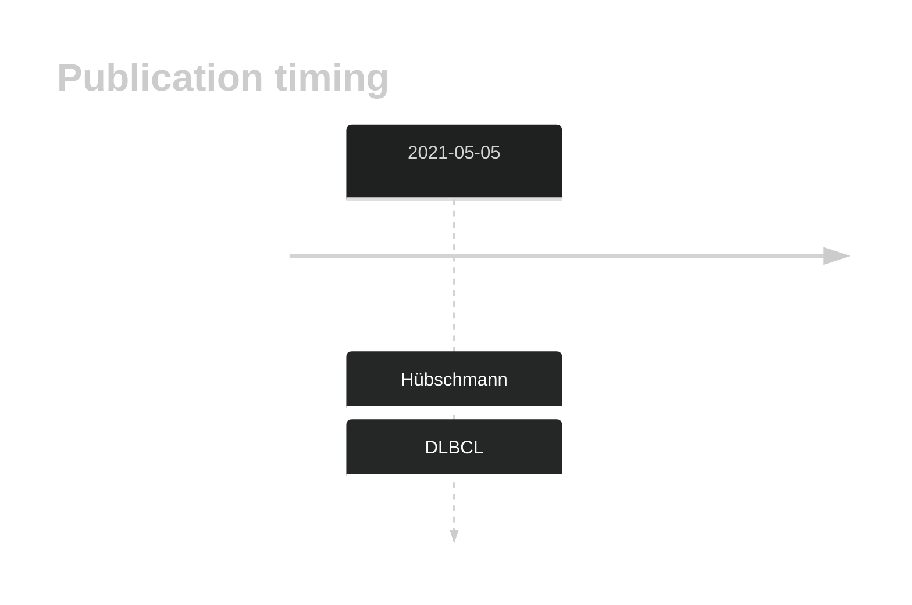

# PNPO

## History
Mutations in this gene were first described in DLBCL and FL in 2021 by Hübschmann et al.1

## Relevance tier by entity

|Entity|Tier|Description                              |
|:------:|:----:|-----------------------------------------|
| |2   |relevance in DLBCL not firmly established[@hubschmannMutationalMechanismsShaping2021]|

## Mutation incidence in large patient cohorts (GAMBL reanalysis)

|Entity|source        |frequency (%)|
|:------:|:--------------:|:-------------:|
|DLBCL |GAMBL genomes |0.38         |
|DLBCL |Schmitz cohort|0.21         |
|DLBCL |Reddy cohort  |0.30         |
|DLBCL |Chapuy cohort |0.85         |

## Mutation pattern and selective pressure estimates

|Entity|aSHM|Significant selection|dN/dS (missense)|dN/dS (nonsense)|
|:------:|:----:|:---------------------:|:----------------:|:----------------:|
|BL    |No  |No                   |2.503           |0               |
|DLBCL |No  |No                   |4.698           |0               |
|FL    |No  |No                   |0.000           |0               |

View coding variants in ProteinPaint [hg19](https://morinlab.github.io/LLMPP/GAMBL/PNPO_protein.html)  or [hg38](https://morinlab.github.io/LLMPP/GAMBL/PNPO_protein_hg38.html)

View all variants in GenomePaint [hg19](https://morinlab.github.io/LLMPP/GAMBL/PNPO.html)  or [hg38](https://morinlab.github.io/LLMPP/GAMBL/PNPO_hg38.html)

## PNPO Expression

## All Mutations

[SP192997](https://www.bcgsc.ca/downloads/morinlab/GAMBL/MALY/SP192997.html)
[SP116610](https://www.bcgsc.ca/downloads/morinlab/GAMBL/MALY/SP116610.html)

## References

<!-- ORIGIN: hubschmannMutationalMechanismsShaping2021b -->
<!-- DLBCL: hubschmannMutationalMechanismsShaping2021b -->
