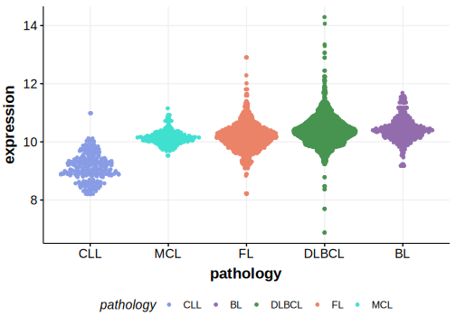

[[_TOC_]]

## Overview

Mutations in this gene were first described in DLBCL and FL in 2021 by Hübschmann et al.[@hubschmannMutationalMechanismsShaping2021]

## Relevance tier by entity

[[include:table1_PNPO.md]]

## Mutation incidence in large patient cohorts (GAMBL reanalysis)

|Entity|source        |frequency (%)|
|:------:|:--------------:|:-------------:|
|DLBCL |GAMBL genomes |0.38         |
|DLBCL |Schmitz cohort|0.21         |
|DLBCL |Reddy cohort  |0.30         |
|DLBCL |Chapuy cohort |0.85         |

## Mutation pattern and selective pressure estimates

[[include:tables/dnds_PNPO.md]]

[[include:browser_PNPO.md]]

## Expression

## All Mutations

[SP192997](https://www.bcgsc.ca/downloads/morinlab/GAMBL/MALY/SP192997.html)
[SP116610](https://www.bcgsc.ca/downloads/morinlab/GAMBL/MALY/SP116610.html)

[[include:tables/mermaid_PNPO.md]]

## References

<!-- ORIGIN: hubschmannMutationalMechanismsShaping2021b -->
<!-- DLBCL: hubschmannMutationalMechanismsShaping2021b -->
