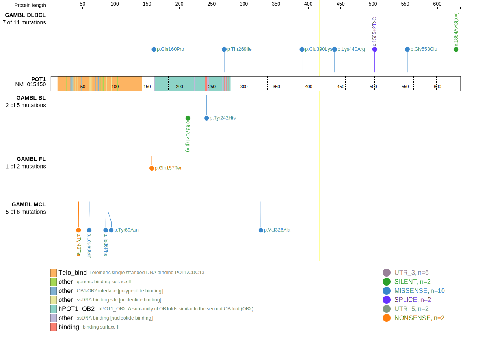
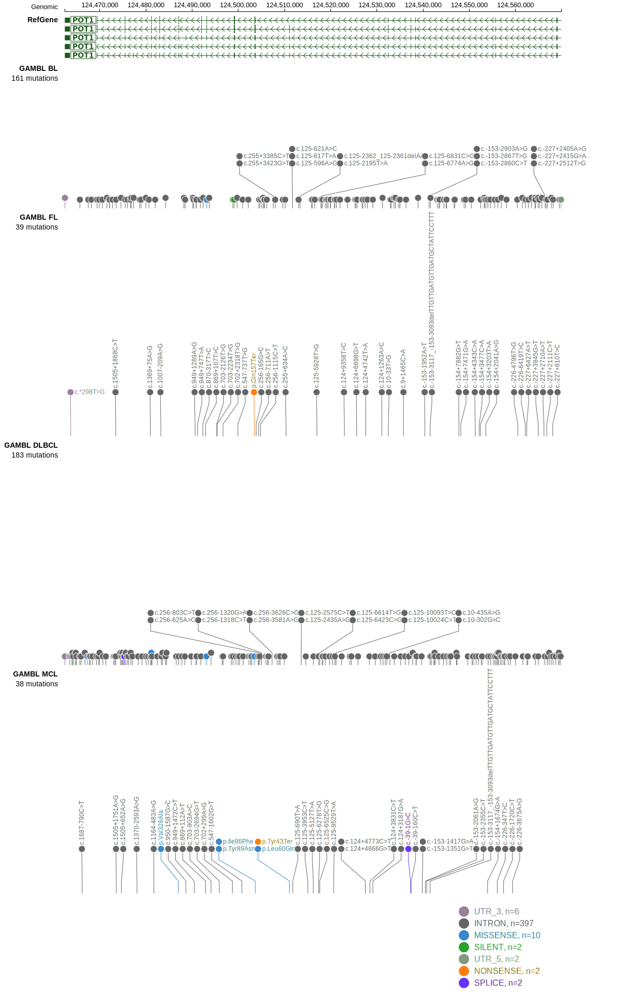

# POT1

## Relevance tier by entity

|Entity|Tier|Description             |
|:------:|:----:|------------------------|
|MCL   |1   |high-confidence MCL gene|

## Mutation incidence in large patient cohorts (GAMBL reanalysis)

|Entity|source       |frequency (%)|
|:------:|:-------------:|:-------------:|
|MCL   |GAMBL genomes|3.32         |

## Mutation pattern and selective pressure estimates

|Entity|aSHM|Significant selection|dN/dS (missense)|dN/dS (nonsense)|
|:------:|:----:|:---------------------:|:----------------:|:----------------:|
|BL    |No  |No                   |0.889           | 0.000          |
|DLBCL |No  |No                   |4.286           | 0.000          |
|FL    |No  |No                   |0.000           |18.704          |

> [!NOTE]
> First described in MCL in 2014 by [Zhang J](https://pubmed.ncbi.nlm.nih.gov/24682267)

View coding variants in ProteinPaint [hg19](https://www.bcgsc.ca/downloads/morinlab/GAMBL/test/genes/POT1_protein.html)  or [hg38](https://www.bcgsc.ca/downloads/morinlab/GAMBL/test/genes/POT1_protein_hg38.html)

View all variants in GenomePaint [hg19](https://www.bcgsc.ca/downloads/morinlab/GAMBL/test/genes/POT1.html)  or [hg38](https://www.bcgsc.ca/downloads/morinlab/GAMBL/test/genes/POT1_hg38.html)

