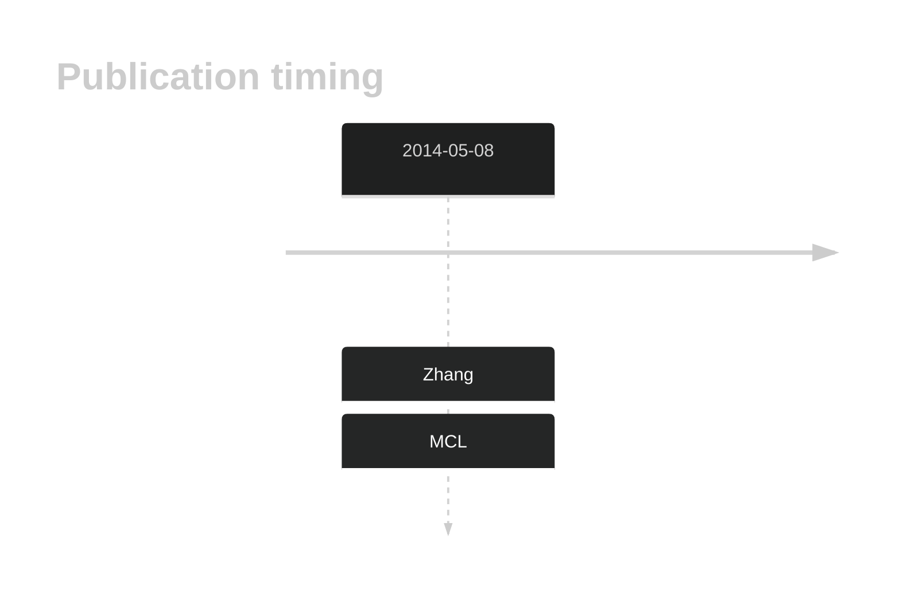

# POT1

## History

## Relevance tier by entity

|Entity|Tier|Description             |
|:------:|:----:|------------------------|
|   |1   |high-confidence MCL gene[@zhangGenomicLandscapeMantle2014]|

## Mutation incidence in large patient cohorts (GAMBL reanalysis)

|Entity|source       |frequency (%)|
|:------:|:-------------:|:-------------:|
|MCL   |GAMBL genomes|3.32         |

## Mutation pattern and selective pressure estimates

|Entity|aSHM|Significant selection|dN/dS (missense)|dN/dS (nonsense)|
|:------:|:----:|:---------------------:|:----------------:|:----------------:|
|BL    |No  |No                   |0.889           | 0.000          |
|DLBCL |No  |No                   |4.286           | 0.000          |
|FL    |No  |No                   |0.000           |18.704          |

View coding variants in ProteinPaint [hg19](https://morinlab.github.io/LLMPP/GAMBL/POT1_protein.html)  or [hg38](https://morinlab.github.io/LLMPP/GAMBL/POT1_protein_hg38.html)

View all variants in GenomePaint [hg19](https://morinlab.github.io/LLMPP/GAMBL/POT1.html)  or [hg38](https://morinlab.github.io/LLMPP/GAMBL/POT1_hg38.html)

## POT1 Expression

<!-- ORIGIN: zhangGenomicLandscapeMantle2014 -->
<!-- MCL: zhangGenomicLandscapeMantle2014 -->

## References

