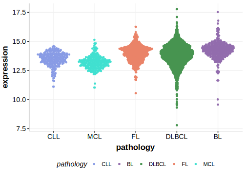

[[_TOC_]]

## Overview
POU2AF1 is one of [a number of genes](https://github.com/morinlab/LLMPP/wiki/ashm) affected by aberrant somatic hypermutation in B-cell lymphomas, which complicates the interpretation of mutations at this locus.

## Relevance tier by entity

|Entity|Tier|Description               |
|:------:|:----:|--------------------------|
||1|high-confidence MZL gene|
| |1   |high-confidence DLBCL gene, hypermutated[@chapuyMolecularSubtypesDiffuse2018]|
|    |1   |high-confidence FL gene, hypermutated   [@krysiakRecurrentSomaticMutations2017]|

## Mutation incidence in large patient cohorts (GAMBL reanalysis)

[[include:DLBCL_POU2AF1.md]]
[[include:FL_POU2AF1.md]]

## Mutation pattern and selective pressure estimates

[[include:dnds_POU2AF1.md]]

## aSHM regions

|chr_name|hg19_start|hg19_end |region                                                                                      |regulatory_comment|
|:--------:|:----------:|:---------:|:--------------------------------------------------------------------------------------------:|:------------------:|
|chr11   |111248078 |111250224|[TSS](https://genome.ucsc.edu/s/rdmorin/GAMBL%20hg19?position=chr11%3A111248078%2D111250224)|active_promoter   |

## POU2AF1 Hotspots

| Chromosome |Coordinate (hg19) | ref>alt | HGVSp | 
 | :---:| :---: | :--: | :---: |
| chr11 | 111249894 | C>T | W3* |
| chr11 | 111249899 | G>A | L2F |
| chr11 | 111249900 | C>T | M1? |
| chr11 | 111275352 | T>C | R6G |

[[include:browser_POU2AF1.md]]

## Expression

<!-- ORIGIN: krysiakRecurrentSomaticMutations2017b -->
<!-- FL: krysiakRecurrentSomaticMutations2017b -->

[[include:mermaid_POU2AF1.md]]

## References

