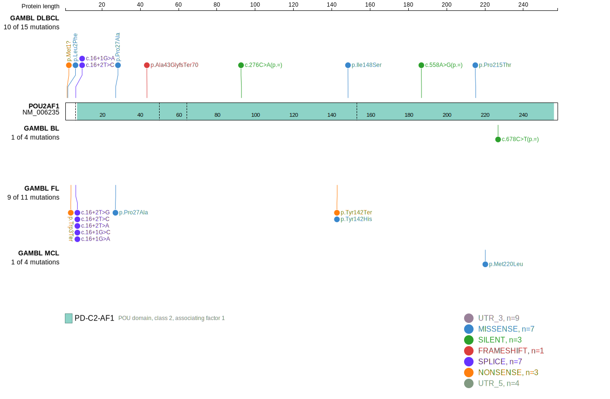

# POU2AF1
## Overview
POU2AF1 is one of [a number of genes](https://github.com/morinlab/LLMPP/wiki/ashm) affected by aberrant somatic hypermutation in B-cell lymphomas, which complicates the interpretation of mutations at this locus.

## Relevance tier by entity

|Entity|Tier|Description               |
|:------:|:----:|--------------------------|
| |1-a   |high-confidence DLBCL gene, hypermutated|
|    |1-a   |high-confidence FL gene, hypermutated   |

## Mutation incidence in large patient cohorts (GAMBL reanalysis)

|Entity|source        |frequency (%)|
|:------:|:--------------:|:-------------:|
|DLBCL |GAMBL genomes | 5.16        |
|DLBCL |Schmitz cohort| 2.34        |
|DLBCL |Reddy cohort  | 3.30        |
|DLBCL |Chapuy cohort | 5.56        |
|FL    |GAMBL genomes |12.24        |

## Mutation pattern and selective pressure estimates

|Entity|aSHM|Significant selection|dN/dS (missense)|dN/dS (nonsense)|
|:------:|:----:|:---------------------:|:----------------:|:----------------:|
|BL    |Yes |No                   |0.000           |  0.000         |
|DLBCL |Yes |No                   |6.798           | 74.689         |
|FL    |Yes |Yes                  |0.000           |659.924         |

## aSHM regions

|chr_name|hg19_start|hg19_end |region                                                                                      |regulatory_comment|
|:--------:|:----------:|:---------:|:--------------------------------------------------------------------------------------------:|:------------------:|
|chr11   |111248078 |111250224|[TSS](https://genome.ucsc.edu/s/rdmorin/GAMBL%20hg19?position=chr11%3A111248078%2D111250224)|active_promoter   |

 ## POU2AF1 Hotspots

| Chromosome |Coordinate (hg19) | ref>alt | HGVSp | 
 | :---:| :---: | :--: | :---: |
| chr11 | 111249894 | C>T | W3* |
| chr11 | 111249899 | G>A | L2F |
| chr11 | 111249900 | C>T | M1? |
| chr11 | 111275352 | T>C | R6G |

View coding variants in ProteinPaint [hg19](https://morinlab.github.io/LLMPP/GAMBL/POU2AF1_protein.html)  or [hg38](https://morinlab.github.io/LLMPP/GAMBL/POU2AF1_protein_hg38.html)

View all variants in GenomePaint [hg19](https://morinlab.github.io/LLMPP/GAMBL/POU2AF1.html)  or [hg38](https://morinlab.github.io/LLMPP/GAMBL/POU2AF1_hg38.html)

## POU2AF1 Expression

<!-- ORIGIN: krysiakRecurrentSomaticMutations2017b -->
<!-- FL: krysiakRecurrentSomaticMutations2017b -->
