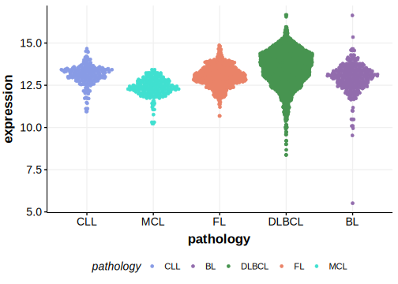

[[_TOC_]]

## Experimental Evidence

Driver mutations affecting this gene in FL/DLBCL have been experimentally demonstrated to cause a reduction or loss of function (LOF).[@hodsonRegulationNormalBcell2016]

## Relevance tier by entity

[[include:table1_POU2F2.md]]

## Mutation incidence in large patient cohorts (GAMBL reanalysis)

### DLBCL
[[include:tables/DLBCL_POU2F2.md]]

### FL
[[include:tables/FL_POU2F2.md]]

## Mutation pattern and selective pressure estimates

[[include:tables/dnds_POU2F2.md]]

## POU2F2 Hotspots

| Chromosome |Coordinate (hg19) | ref>alt | HGVSp | 
 | :---:| :---: | :--: | :---: |
| chr19 | 42600031 | C>G | Q238H |
| chr19 | 42600031 | C>A | Q238H |
| chr19 | 42600030 | T>C | T239A |
| chr19 | 42600030 | T>A | T239S |

[[include:browser_POU2F2.md]]

## Expression

<!-- ORIGIN: zhangGeneticHeterogeneityDiffuse2013 -->
<!-- DLBCL: zhangGeneticHeterogeneityDiffuse2013 -->
<!-- FL: krysiakRecurrentSomaticMutations2017b -->

[[include:tables/mermaid_POU2F2.md]]

## References

