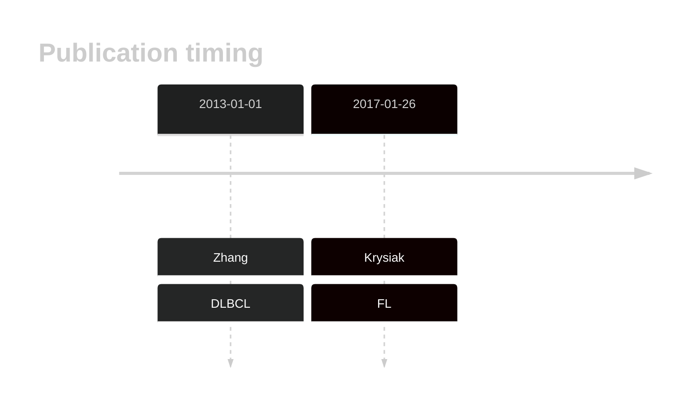

# POU2F2
## History

## Relevance tier by entity

|Entity|Tier|Description               |
|:------:|:----:|--------------------------|
| |1   |high-confidence DLBCL gene|
|    |1   |high-confidence FL gene   |

## Mutation incidence in large patient cohorts (GAMBL reanalysis)

|Entity|source        |frequency (%)|
|:------:|:--------------:|:-------------:|
|DLBCL |GAMBL genomes |5.93         |
|DLBCL |Schmitz cohort|6.38         |
|DLBCL |Reddy cohort  |3.40         |
|DLBCL |Chapuy cohort |6.41         |
|FL    |GAMBL genomes |6.24         |

## Mutation pattern and selective pressure estimates

|Entity|aSHM|Significant selection|dN/dS (missense)|dN/dS (nonsense)|
|:------:|:----:|:---------------------:|:----------------:|:----------------:|
|BL    |No  |No                   | 3.431          | 0.000          |
|DLBCL |No  |Yes                  |12.445          |51.943          |
|FL    |No  |No                   |17.646          | 0.000          |

 ## POU2F2 Hotspots

| Chromosome |Coordinate (hg19) | ref>alt | HGVSp | 
 | :---:| :---: | :--: | :---: |
| chr19 | 42600031 | C>G | Q238H |
| chr19 | 42600031 | C>A | Q238H |
| chr19 | 42600030 | T>C | T239A |
| chr19 | 42600030 | T>A | T239S |

View coding variants in ProteinPaint [hg19](https://morinlab.github.io/LLMPP/GAMBL/POU2F2_protein.html)  or [hg38](https://morinlab.github.io/LLMPP/GAMBL/POU2F2_protein_hg38.html)

View all variants in GenomePaint [hg19](https://morinlab.github.io/LLMPP/GAMBL/POU2F2.html)  or [hg38](https://morinlab.github.io/LLMPP/GAMBL/POU2F2_hg38.html)

## POU2F2 Expression

<!-- ORIGIN: zhangGeneticHeterogeneityDiffuse2013 -->
<!-- DLBCL: zhangGeneticHeterogeneityDiffuse2013 -->
<!-- FL: krysiakRecurrentSomaticMutations2017b -->
## References
1.  Zhang J, Grubor V, Love CL, Banerjee A, Richards KL, Mieczkowski PA, Dunphy C, Choi W, Au WY, Srivastava G, Lugar PL, Rizzieri DA, Lagoo AS, Bernal-Mizrachi L, Mann KP, Flowers C, Naresh K, Evens A, Gordon LI, Czader M, Gill JI, Hsi ED, Liu Q, Fan A, Walsh K, Jima D, Smith LL, Johnson AJ, Byrd JC, Luftig MA, Ni T, Zhu J, Chadburn A, Levy S, Dunson D, Dave SS. Genetic heterogeneity of diffuse large B-cell lymphoma. 2013 Jan; 
2.  Krysiak K, Gomez F, White BS, Matlock M, Miller CA, Trani L, Fronick CC, Fulton RS, Kreisel F, Cashen AF, Carson KR, Berrien-Elliott MM, Bartlett NL, Griffith M, Griffith OL, Fehniger TA. Recurrent somatic mutations affecting B-cell receptor signaling pathway genes in follicular lymphoma. Blood. 2017 Jan 26;129(4):473–483. PMCID: PMC5270390
