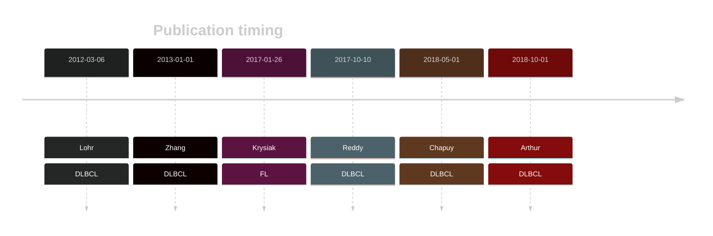
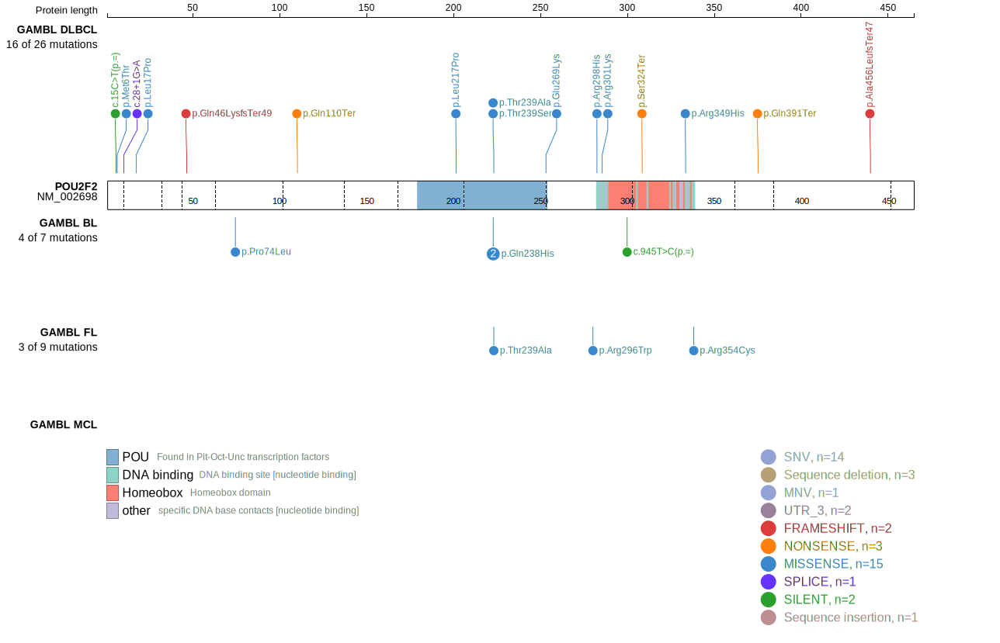
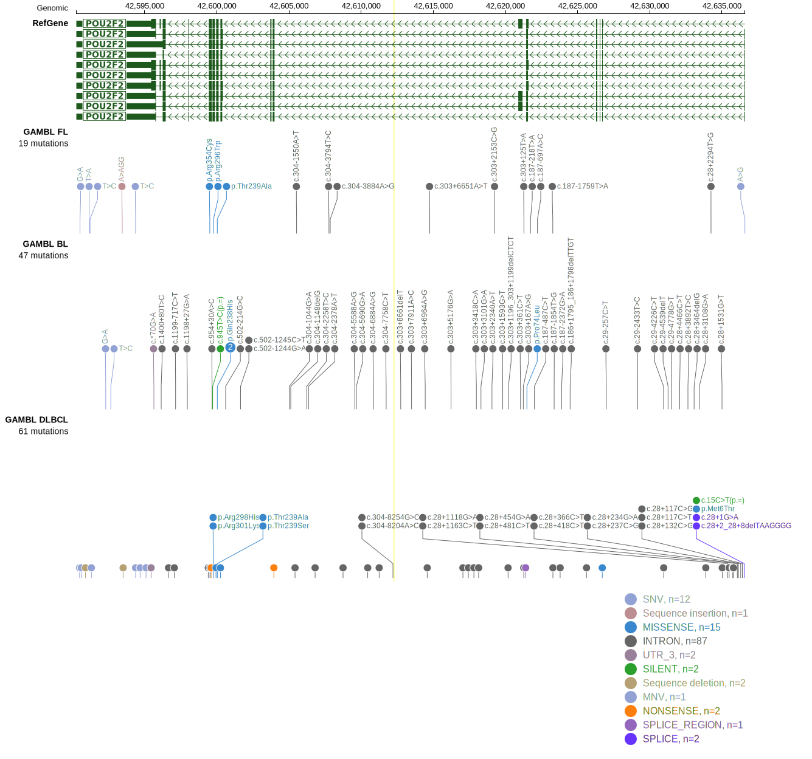

# POU2F2

## History

## Relevance tier by entity

|Entity|Tier|Description               |
|:------:|:----:|--------------------------|
| |1   |high-confidence DLBCL gene[@lohrDiscoveryPrioritizationSomatic2012a; @zhangGeneticHeterogeneityDiffuse2013; @reddyGeneticFunctionalDrivers2017]|
|    |1   |high-confidence FL gene   [@krysiakRecurrentSomaticMutations2017b]|

## Mutation incidence in large patient cohorts (GAMBL reanalysis)

|Entity|source        |frequency (%)|
|:------:|:--------------:|:-------------:|
|DLBCL |GAMBL genomes |5.93         |
|DLBCL |Schmitz cohort|6.38         |
|DLBCL |Reddy cohort  |3.40         |
|DLBCL |Chapuy cohort |6.41         |
|FL    |GAMBL genomes |6.24         |

## Mutation pattern and selective pressure estimates

|Entity|aSHM|Significant selection|dN/dS (missense)|dN/dS (nonsense)|
|:------:|:----:|:---------------------:|:----------------:|:----------------:|
|BL    |No  |No                   | 3.431          | 0.000          |
|DLBCL |No  |Yes                  |12.445          |51.943          |
|FL    |No  |No                   |17.646          | 0.000          |

## POU2F2 Hotspots

| Chromosome |Coordinate (hg19) | ref>alt | HGVSp | 
 | :---:| :---: | :--: | :---: |
| chr19 | 42600031 | C>G | Q238H |
| chr19 | 42600031 | C>A | Q238H |
| chr19 | 42600030 | T>C | T239A |
| chr19 | 42600030 | T>A | T239S |

View coding variants in ProteinPaint [hg19](https://morinlab.github.io/LLMPP/GAMBL/POU2F2_protein.html)  or [hg38](https://morinlab.github.io/LLMPP/GAMBL/POU2F2_protein_hg38.html)

View all variants in GenomePaint [hg19](https://morinlab.github.io/LLMPP/GAMBL/POU2F2.html)  or [hg38](https://morinlab.github.io/LLMPP/GAMBL/POU2F2_hg38.html)

## POU2F2 Expression

<!-- ORIGIN: zhangGeneticHeterogeneityDiffuse2013 -->
<!-- DLBCL: zhangGeneticHeterogeneityDiffuse2013 -->
<!-- FL: krysiakRecurrentSomaticMutations2017b -->

## References

