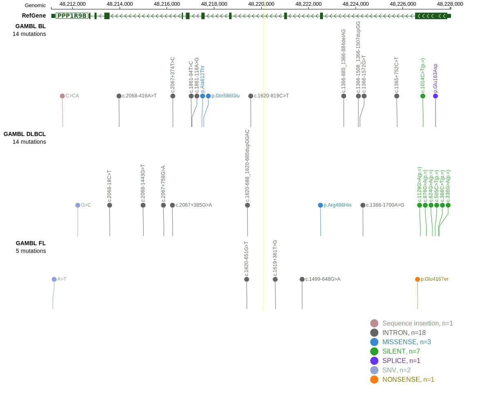
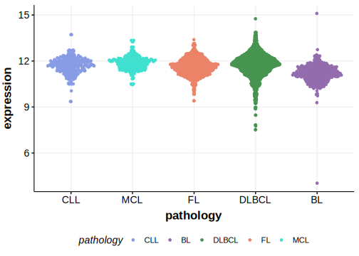

# PPP1R9B

## Relevance tier by entity

|Entity|Tier|Description               |
|:------:|:----:|--------------------------|
| | 2   | low-confidence DLBCL gene|

## Mutation incidence in large patient cohorts (GAMBL reanalysis)

|Entity|source        |frequency (%)|
|:------:|:--------------:|:-------------:|
|DLBCL |GAMBL genomes |0.38         |
|DLBCL |Schmitz cohort|3.40         |
|DLBCL |Reddy cohort  |0.70         |
|DLBCL |Chapuy cohort |1.71         |

## Mutation pattern and selective pressure estimates

|Entity|aSHM|Significant selection|dN/dS (missense)|dN/dS (nonsense)|
|:------:|:----:|:---------------------:|:----------------:|:----------------:|
|BL    |No  |No                   |1.267           |10.265          |
|DLBCL |No  |No                   |0.632           | 0.000          |
|FL    |No  |No                   |0.000           |34.824          |

View coding variants in ProteinPaint [hg19](https://morinlab.github.io/LLMPP/GAMBL/PPP1R9B_protein.html)  or [hg38](https://morinlab.github.io/LLMPP/GAMBL/PPP1R9B_protein_hg38.html)

View all variants in GenomePaint [hg19](https://morinlab.github.io/LLMPP/GAMBL/PPP1R9B.html)  or [hg38](https://morinlab.github.io/LLMPP/GAMBL/PPP1R9B_hg38.html)

## PPP1R9B Expression

<!-- FLAGGED FOR TIER 2 -->

<!-- ORIGIN: Unknown -->

## References
