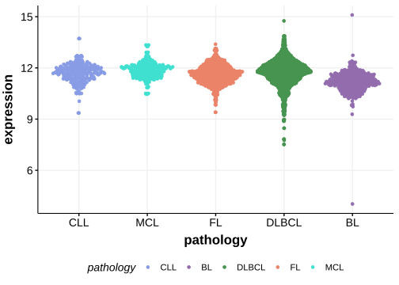

# PPP1R9B

## Relevance tier by entity

|Entity|Tier|Description               |
|:------:|:----:|--------------------------|
| | 2   | low-confidence DLBCL gene|

## Mutation incidence in large patient cohorts (GAMBL reanalysis)

### BL
[[include:tables/BL_PPP1R9B.md]]

### DLBCL
[[include:tables/DLBCL_PPP1R9B.md]]

### FL
[[include:tables/FL_PPP1R9B.md]]

## Mutation pattern and selective pressure estimates

|Entity|aSHM|Significant selection|dN/dS (missense)|dN/dS (nonsense)|
|:------:|:----:|:---------------------:|:----------------:|:----------------:|
|BL    |No  |No                   |1.267           |10.265          |
|DLBCL |No  |No                   |0.632           | 0.000          |
|FL    |No  |No                   |0.000           |34.824          |

[[include:tables/browser_PPP1R9B.md]]

## Expression

<!-- FLAGGED FOR TIER 2 -->

<!-- ORIGIN: Unknown -->

## References
