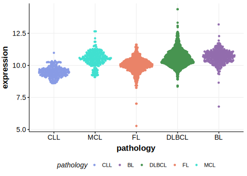

[[_TOC_]]

## Relevance tier by entity

[[include:tables/table1_PPP4C.md]]

## Mutation incidence in large patient cohorts (GAMBL reanalysis)

|Entity|source       |frequency (%)|
|:------:|:-------------:|:-------------:|
|FL    |GAMBL genomes|2.08         |

## Mutation pattern and selective pressure estimates

[[include:tables/dnds_PPP4C.md]]

## PPP4C Hotspots

| Chromosome |Coordinate (hg19) | ref>alt | HGVSp | 
 | :---:| :---: | :--: | :---: |
| chr16 | 30093814 | G>A | D54N |

[[include:browser_PPP4C.md]]

## Expression

<!-- ORIGIN: hubschmannMutationalMechanismsShaping2021b -->
<!-- FL: hubschmannMutationalMechanismsShaping2021b -->

## All Mutations

[SP192997](https://www.bcgsc.ca/downloads/morinlab/GAMBL/MALY/SP192997.html)
[SP116720](https://www.bcgsc.ca/downloads/morinlab/GAMBL/MALY/SP116720.html)
[SP192997](https://www.bcgsc.ca/downloads/morinlab/GAMBL/MALY/SP192997.html)
[SP59320](https://www.bcgsc.ca/downloads/morinlab/GAMBL/MALY/SP59320.html)

[[include:tables/mermaid_PPP4C.md]]

## References
