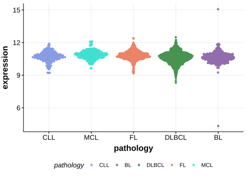

[[_TOC_]]

## Relevance tier by entity

[[include:tables/table1_PPP6R2.md]]

## Mutation incidence in large patient cohorts (GAMBL reanalysis)

### BL
[[include:tables/BL_PPP6R2.md]]

### DLBCL
[[include:tables/DLBCL_PPP6R2.md]]

### FL
[[include:tables/FL_PPP6R2.md]]

## Mutation pattern and selective pressure estimates

[[include:tables/dnds_PPP6R2.md]]

[[include:tables/browser_PPP6R2.md]]

## Expression

<!-- ORIGIN: burkhardtClinicalRelevanceMolecular2022b -->
<!-- BL: burkhardtClinicalRelevanceMolecular2022b -->

[[include:tables/mermaid_PPP6R2.md]]

## References

