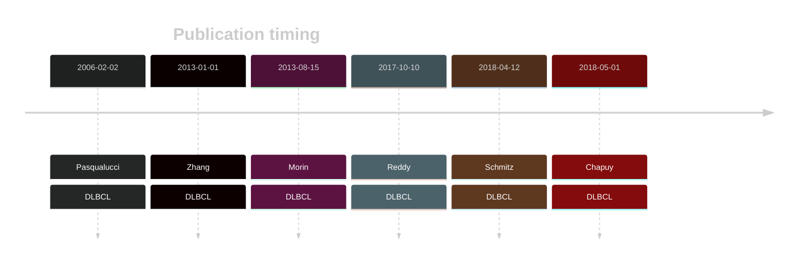
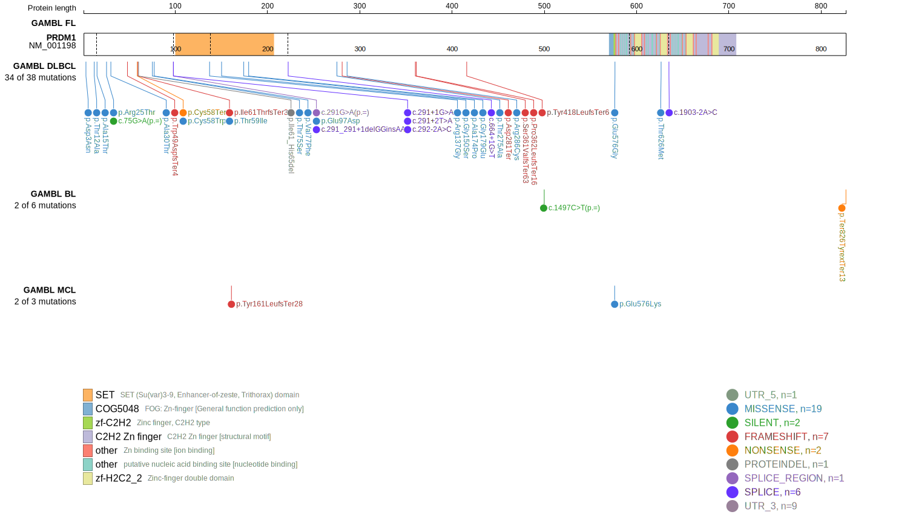
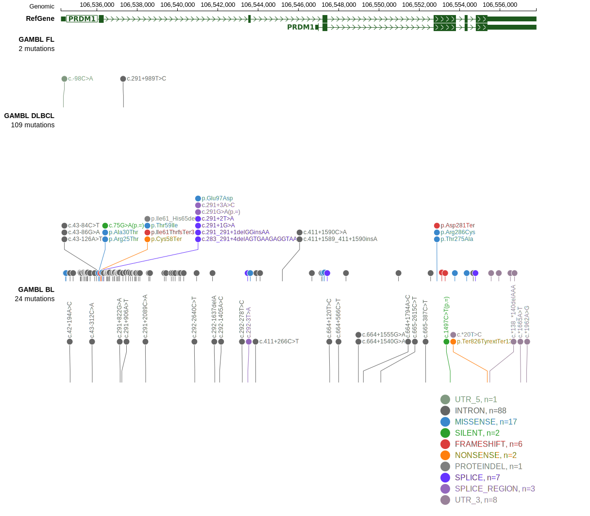
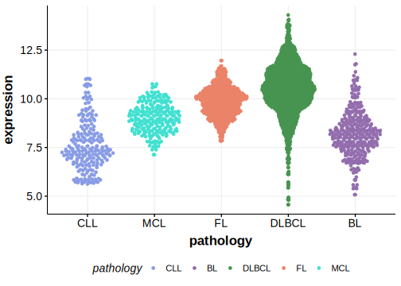

# PRDM1

## History

## Relevance tier by entity

|Entity|Tier|Description                           |
|:------:|:----:|--------------------------------------|
| |1   |high-confidence DLBCL gene            [@pasqualucciInactivationPRDM1BLIMP12006; @zhangGeneticHeterogeneityDiffuse2013; @morinMutationalStructuralAnalysis2013; @reddyGeneticFunctionalDrivers2017]|

## Mutation incidence in large patient cohorts (GAMBL reanalysis)

|Entity|source               |frequency (%)|
|:------:|:---------------------:|:-------------:|
|BL    |GAMBL genomes+capture| 2.31        |
|BL    |Thomas cohort        | 0.80        |
|BL    |Panea cohort         | 5.90        |
|DLBCL |GAMBL genomes        | 6.88        |
|DLBCL |Schmitz cohort       |10.21        |
|DLBCL |Reddy cohort         | 5.41        |
|DLBCL |Chapuy cohort        | 8.55        |

## Mutation pattern and selective pressure estimates

|Entity|aSHM|Significant selection|dN/dS (missense)|dN/dS (nonsense)|
|:------:|:----:|:---------------------:|:----------------:|:----------------:|
|BL    |No  |No                   |0.746           | 0.000          |
|DLBCL |No  |Yes                  |4.912           |23.497          |
|FL    |No  |No                   |0.000           | 0.000          |

## PRDM1 Hotspots

| Chromosome |Coordinate (hg19) | ref>alt | HGVSp | 
 | :---:| :---: | :--: | :---: |
| chr6 | 106536207 | T>A | C58* |
| chr6 | 106536207 | T>G | C58W |
| chr6 | 106536209 | C>T | T59I |
| chr6 | 106536256 | A>T | T75S |
| chr6 | 106536262 | G>T | V77F |
| chr6 | 106536324 | G>A | E97= |
| chr6 | 106536324 | G>C | E97D |

View coding variants in ProteinPaint [hg19](https://morinlab.github.io/LLMPP/GAMBL/PRDM1_protein.html)  or [hg38](https://morinlab.github.io/LLMPP/GAMBL/PRDM1_protein_hg38.html)

View all variants in GenomePaint [hg19](https://morinlab.github.io/LLMPP/GAMBL/PRDM1.html)  or [hg38](https://morinlab.github.io/LLMPP/GAMBL/PRDM1_hg38.html)

## PRDM1 Expression

<!-- ORIGIN: pasqualucciInactivationPRDM1BLIMP12006 -->
<!-- DLBCL: pasqualucciInactivationPRDM1BLIMP12006a -->
<!-- BL: 2 -->

## References

