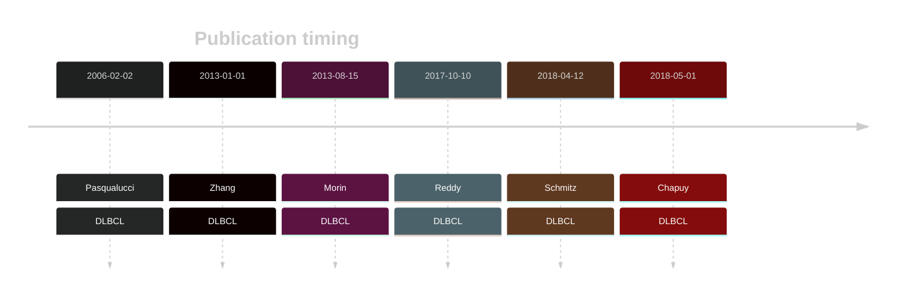

# PRDM1

## History

## Relevance tier by entity

|Entity|Tier|Description                           |
|:------:|:----:|--------------------------------------|
| |1   |high-confidence DLBCL gene            [@pasqualucciInactivationPRDM1BLIMP12006; @zhangGeneticHeterogeneityDiffuse2013; @morinMutationalStructuralAnalysis2013; @reddyGeneticFunctionalDrivers2017]|

## Mutation incidence in large patient cohorts (GAMBL reanalysis)

[[include:DLBCL_PRDM1.md]]
[[include:BL_PRDM1.md]]

## Mutation pattern and selective pressure estimates

[[include:dnds_PRDM1.md]]

## PRDM1 Hotspots

| Chromosome |Coordinate (hg19) | ref>alt | HGVSp | 
 | :---:| :---: | :--: | :---: |
| chr6 | 106536207 | T>A | C58* |
| chr6 | 106536207 | T>G | C58W |
| chr6 | 106536209 | C>T | T59I |
| chr6 | 106536256 | A>T | T75S |
| chr6 | 106536262 | G>T | V77F |
| chr6 | 106536324 | G>A | E97= |
| chr6 | 106536324 | G>C | E97D |

View coding variants in ProteinPaint [hg19](https://morinlab.github.io/LLMPP/GAMBL/PRDM1_protein.html)  or [hg38](https://morinlab.github.io/LLMPP/GAMBL/PRDM1_protein_hg38.html)

View all variants in GenomePaint [hg19](https://morinlab.github.io/LLMPP/GAMBL/PRDM1.html)  or [hg38](https://morinlab.github.io/LLMPP/GAMBL/PRDM1_hg38.html)

## PRDM1 Expression

<!-- ORIGIN: pasqualucciInactivationPRDM1BLIMP12006 -->
<!-- DLBCL: pasqualucciInactivationPRDM1BLIMP12006a -->
<!-- BL: 2 -->

## References

