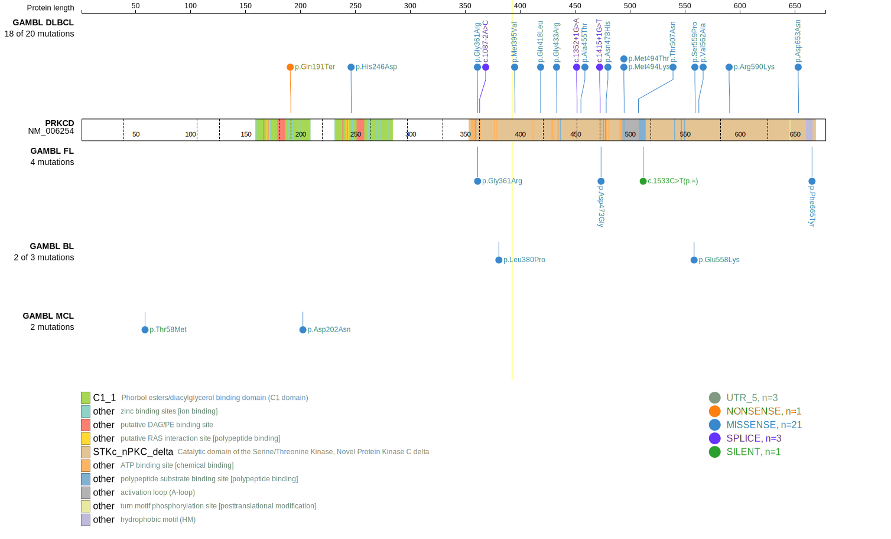
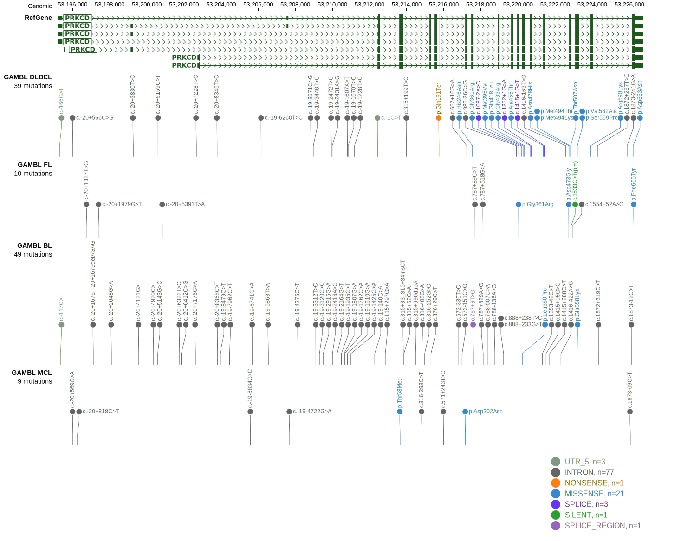

# [PRKCD]

## Mutation tier

|Entity|Tier|Description                           |
|:------:|:----:|--------------------------------------|
|BL    |2   |relevance in BL not firmly established|
## Mutation incidence

|Entity|source               |frequency (%)|
|:------:|:---------------------:|:-------------:|
|BL    |GAMBL genomes+capture|2.31         |
|BL    |Thomas cohort        |1.30         |
|BL    |Panea cohort         |5.90         |

## Mutation pattern

|Entity|aSHM|Significant selection|dN/dS (missense)|dN/dS (nonsense)|
|:------:|:----:|:---------------------:|:----------------:|:----------------:|
|BL    |No  |No                   | 2.225          | 0.000          |
|DLBCL |No  |Yes                  |11.290          |71.966          |
|FL    |No  |No                   |25.696          | 0.000          |

View coding variants in ProteinPaint [hg19](https://www.bcgsc.ca/downloads/morinlab/GAMBL/test/genes/PRKCD_protein.html)  or [hg38](https://www.bcgsc.ca/downloads/morinlab/GAMBL/test/genes/PRKCD_protein_hg38.html)

View all variants in GenomePaint [hg19](https://www.bcgsc.ca/downloads/morinlab/GAMBL/test/genes/PRKCD.html)  or [hg38](https://www.bcgsc.ca/downloads/morinlab/GAMBL/test/genes/PRKCD_hg38.html)

