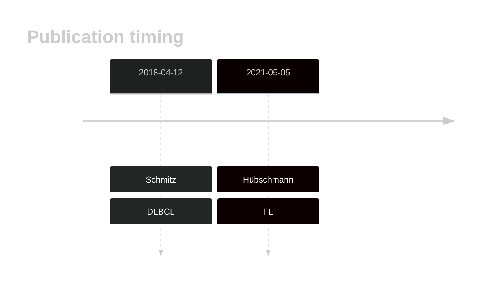
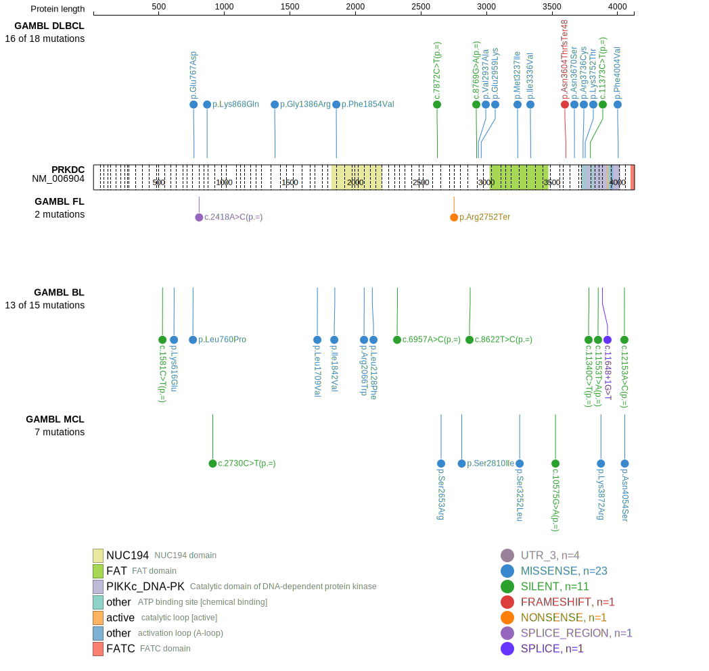
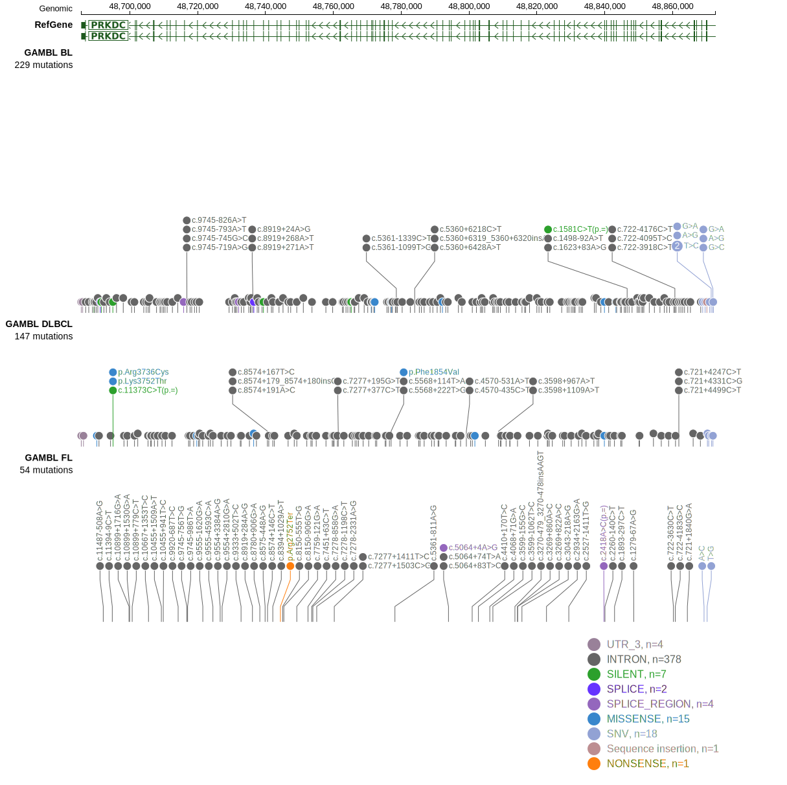
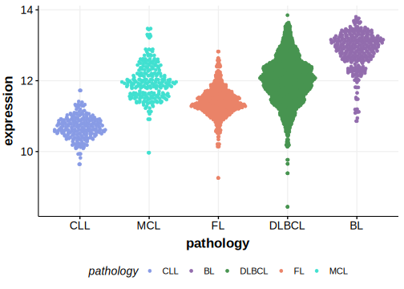

# PRKDC

## History

## Relevance tier by entity

|Entity|Tier|Description                           |
|:------:|:----:|--------------------------------------|
||1|high-confidence PMBL/cHL/GZL gene|
| |1   |high-confidence DLBCL gene            |
|    |2   |relevance in FL not firmly established|

## Mutation incidence in large patient cohorts (GAMBL reanalysis)

|Entity|source        |frequency (%)|
|:------:|:--------------:|:-------------:|
|DLBCL |GAMBL genomes |2.68         |
|DLBCL |Schmitz cohort|7.66         |
|DLBCL |Reddy cohort  |6.61         |
|DLBCL |Chapuy cohort |6.41         |
|FL    |GAMBL genomes |3.00         |

## Mutation pattern and selective pressure estimates

|Entity|aSHM|Significant selection|dN/dS (missense)|dN/dS (nonsense)|
|:------:|:----:|:---------------------:|:----------------:|:----------------:|
|BL    |No  |No                   |0.571           |0.939           |
|DLBCL |No  |No                   |1.076           |0.000           |
|FL    |No  |No                   |0.000           |7.794           |

View coding variants in ProteinPaint [hg19](https://morinlab.github.io/LLMPP/GAMBL/PRKDC_protein.html)  or [hg38](https://morinlab.github.io/LLMPP/GAMBL/PRKDC_protein_hg38.html)

View all variants in GenomePaint [hg19](https://morinlab.github.io/LLMPP/GAMBL/PRKDC.html)  or [hg38](https://morinlab.github.io/LLMPP/GAMBL/PRKDC_hg38.html)

## PRKDC Expression

<!-- ORIGIN: schmitzGeneticsPathogenesisDiffuse2018a -->
<!-- DLBCL: schmitzGeneticsPathogenesisDiffuse2018a -->
<!-- FL: hubschmannMutationalMechanismsShaping2021b -->

## All Mutations

[SP192833](https://www.bcgsc.ca/downloads/morinlab/GAMBL/MALY/SP192833.html)
[SP116701](https://www.bcgsc.ca/downloads/morinlab/GAMBL/MALY/SP116701.html)
[SP59304](https://www.bcgsc.ca/downloads/morinlab/GAMBL/MALY/SP59304.html)
[SP192765](https://www.bcgsc.ca/downloads/morinlab/GAMBL/MALY/SP192765.html)
[SP194065](https://www.bcgsc.ca/downloads/morinlab/GAMBL/MALY/SP194065.html)
[SP116720](https://www.bcgsc.ca/downloads/morinlab/GAMBL/MALY/SP116720.html)

## References
1.  Schmitz R, Wright GW, Huang DW, Johnson CA, Phelan JD, Wang JQ, Roulland S, Kasbekar M, Young RM, Shaffer AL, Hodson DJ, Xiao W, Yu X, Yang Y, Zhao H, Xu W, Liu X, Zhou B, Du W, Chan WC, Jaffe ES, Gascoyne RD, Connors JM, Campo E, Lopez-Guillermo A, Rosenwald A, Ott G, Delabie J, Rimsza LM, Tay Kuang Wei K, Zelenetz AD, Leonard JP, Bartlett NL, Tran B, Shetty J, Zhao Y, Soppet DR, Pittaluga S, Wilson WH, Staudt LM. Genetics and Pathogenesis of Diffuse Large B-Cell Lymphoma. N Engl J Med. 2018 Apr 12;378(15):1396–1407. PMCID: PMC6010183
2.  Hübschmann D, Kleinheinz K, Wagener R, Bernhart SH, López C, Toprak UH, Sungalee S, Ishaque N, Kretzmer H, Kreuz M, Waszak SM, Paramasivam N, Ammerpohl O, Aukema SM, Beekman R, Bergmann AK, Bieg M, Binder H, Borkhardt A, Borst C, Brors B, Bruns P, Carrillo de Santa Pau E, Claviez A, Doose G, Haake A, Karsch D, Haas S, Hansmann ML, Hoell JI, Hovestadt V, Huang B, Hummel M, Jäger-Schmidt C, Kerssemakers JNA, Korbel JO, Kube D, Lawerenz C, Lenze D, Martens JHA, Ott G, Radlwimmer B, Reisinger E, Richter J, Rico D, Rosenstiel P, Rosenwald A, Schillhabel M, Stilgenbauer S, Stadler PF, Martín-Subero JI, Szczepanowski M, Warsow G, Weniger MA, Zapatka M, Valencia A, Stunnenberg HG, Lichter P, Möller P, Loeffler M, Eils R, Klapper W, Hoffmann S, Trümper L, ICGC MMML-Seq consortium, ICGC DE-Mining consortium, BLUEPRINT consortium, Küppers R, Schlesner M, Siebert R. Mutational mechanisms shaping the coding and noncoding genome of germinal center derived B-cell lymphomas. Leukemia. 2021 Jul;35(7):2002–2016. PMCID: PMC8257491
