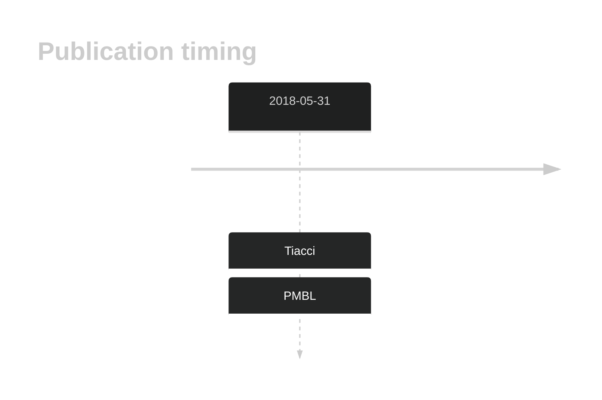

# PRUNE2

## History

## Relevance tier by entity

|Entity|Tier|Description|
|:------:|:----:|--------------------------------------|
||2|relevance in PMBL/cHL/GZL not firmly established[@tiacciPervasiveMutationsJAKSTAT2018]|

## Mutation incidence in large patient cohorts (GAMBL reanalysis)

|Entity|source |frequency (%)|
|:------:|:----:|:----:|
|BL|GAMBL Exome |9.195 |
|BL|GAMBL Genome |3.089 |
|DLBCL|GAMBL Exome |4.906 |
|DLBCL|GAMBL Genome |3.008 |
|FL|GAMBL Exome |0.86 |
|MCL|GAMBL Genome |1.17 |

## References

