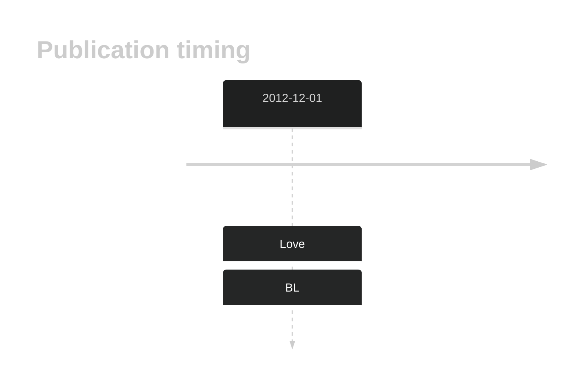

# PTEN

## History

## Relevance tier by entity

|Entity|Tier|Description               |
|:------:|:----:|--------------------------|
|    |1   |high-confidence BL gene   |
| |1   |high-confidence DLBCL gene|

## Mutation incidence in large patient cohorts (GAMBL reanalysis)

|Entity|source               |frequency (%)|
|:------:|:---------------------:|:-------------:|
|BL    |GAMBL genomes+capture|4.16         |
|BL    |Thomas cohort        |4.70         |
|BL    |Panea cohort         |4.00         |
|DLBCL |GAMBL genomes        |3.82         |
|DLBCL |Schmitz cohort       |4.26         |
|DLBCL |Reddy cohort         |3.10         |
|DLBCL |Chapuy cohort        |4.70         |

## Mutation pattern and selective pressure estimates

|Entity|aSHM|Significant selection|dN/dS (missense)|dN/dS (nonsense)|
|:------:|:----:|:---------------------:|:----------------:|:----------------:|
|BL    |No  |Yes                  |22.104          |81.225          |
|DLBCL |No  |No                   | 4.548          |76.677          |
|FL    |No  |No                   | 4.634          | 0.000          |

View coding variants in ProteinPaint [hg19](https://morinlab.github.io/LLMPP/GAMBL/PTEN_protein.html)  or [hg38](https://morinlab.github.io/LLMPP/GAMBL/PTEN_protein_hg38.html)

View all variants in GenomePaint [hg19](https://morinlab.github.io/LLMPP/GAMBL/PTEN.html)  or [hg38](https://morinlab.github.io/LLMPP/GAMBL/PTEN_hg38.html)

## PTEN Expression

<!-- ORIGIN: loveGeneticLandscapeMutations2012 -->
<!-- BL: loveGeneticLandscapeMutations2012 -->

## References
1.  Love C, Sun Z, Jima D, Li G, Zhang J, Miles R, Richards KL, Dunphy CH, Choi WWL, Srivastava G, Lugar PL, Rizzieri DA, Lagoo AS, Bernal-Mizrachi L, Mann KP, Flowers CR, Naresh KN, Evens AM, Chadburn A, Gordon LI, Czader MB, Gill JI, Hsi ED, Greenough A, Moffitt AB, McKinney M, Banerjee A, Grubor V, Levy S, Dunson DB, Dave SS. The genetic landscape of mutations in Burkitt lymphoma. Nat Genet. 2012 Dec;44(12):1321–1325. PMCID: PMC3674561
