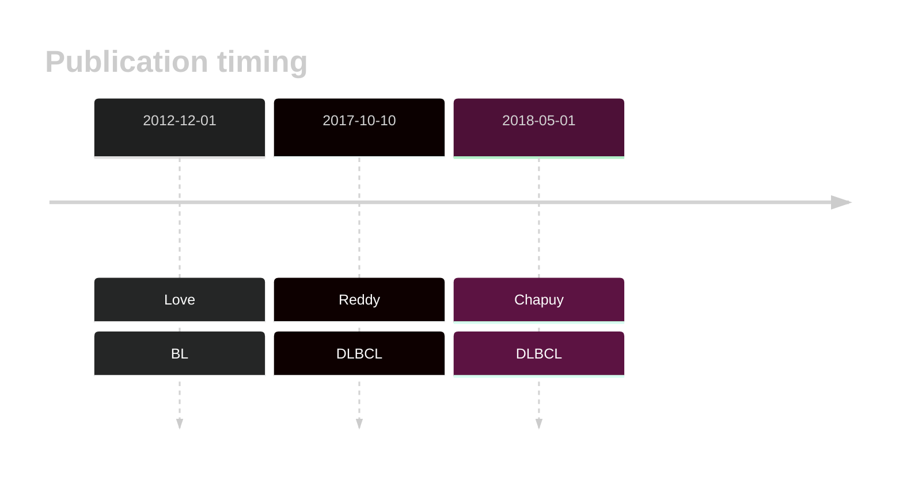

# PTEN

## History

## Relevance tier by entity

|Entity|Tier|Description               |
|:------:|:----:|--------------------------|
|    |1   |high-confidence BL gene   [@loveGeneticLandscapeMutations2012]|
| |1   |high-confidence DLBCL gene[@reddyGeneticFunctionalDrivers2017; @chapuyMolecularSubtypesDiffuse2018b]|

## Mutation incidence in large patient cohorts (GAMBL reanalysis)

[[include:DLBCL_PTEN.md]]
[[include:BL_PTEN.md]]

## Mutation pattern and selective pressure estimates

|Entity|aSHM|Significant selection|dN/dS (missense)|dN/dS (nonsense)|
|:------:|:----:|:---------------------:|:----------------:|:----------------:|
|BL    |No  |Yes                  |22.104          |81.225          |
|DLBCL |No  |No                   | 4.548          |76.677          |
|FL    |No  |No                   | 4.634          | 0.000          |

View coding variants in ProteinPaint [hg19](https://morinlab.github.io/LLMPP/GAMBL/PTEN_protein.html)  or [hg38](https://morinlab.github.io/LLMPP/GAMBL/PTEN_protein_hg38.html)

View all variants in GenomePaint [hg19](https://morinlab.github.io/LLMPP/GAMBL/PTEN.html)  or [hg38](https://morinlab.github.io/LLMPP/GAMBL/PTEN_hg38.html)

## PTEN Expression

<!-- ORIGIN: loveGeneticLandscapeMutations2012 -->
<!-- BL: loveGeneticLandscapeMutations2012 -->

## References

