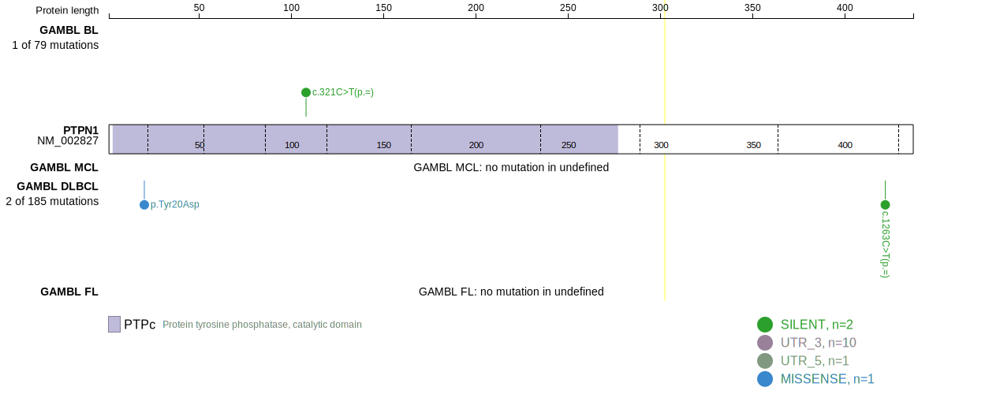
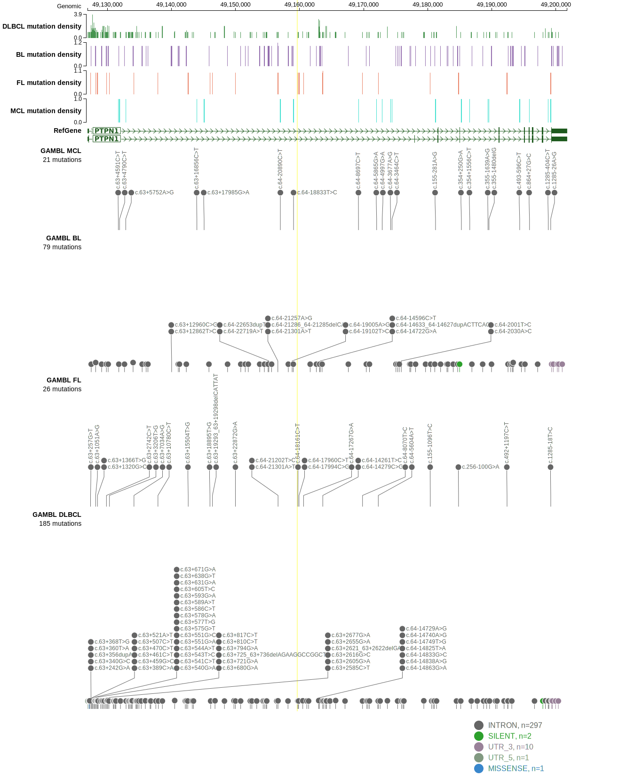

# PTPN1

## Relevance tier by entity

|Entity|Tier|Description                              |
|:------:|:----:|-----------------------------------------|
||1|high-confidence PMBL/cHL/GZL gene|
| |2-a | aSHM target; Although recurrent, the relevance of mutations in DLBCL is tenuous |

## Mutation incidence in large patient cohorts (GAMBL reanalysis)

|Entity|source        |frequency (%)|
|:------:|:--------------:|:-------------:|
|DLBCL |GAMBL genomes |0.19         |
|DLBCL |Schmitz cohort|1.06         |
|DLBCL |Reddy cohort  |1.40         |
|DLBCL |Chapuy cohort |0.43         |

## Mutation pattern and selective pressure estimates

|Entity|aSHM|Significant selection|dN/dS (missense)|dN/dS (nonsense)|
|:------:|:----:|:---------------------:|:----------------:|:----------------:|
|BL    |Yes |No                   |0               |0               |
|DLBCL |Yes |No                   |0               |0               |
|FL    |Yes |No                   |0               |0               |

## aSHM regions

|chr_name|hg19_start|hg19_end|region                                                                                    |regulatory_comment|
|:--------:|:----------:|:--------:|:------------------------------------------------------------------------------------------:|:------------------:|
|chr20   |49120482  |49140477|[TSS](https://genome.ucsc.edu/s/rdmorin/GAMBL%20hg19?position=chr20%3A49120482%2D49140477)|active_promoter   |

View coding variants in ProteinPaint [hg19](https://morinlab.github.io/LLMPP/GAMBL/PTPN1_protein.html)  or [hg38](https://morinlab.github.io/LLMPP/GAMBL/PTPN1_protein_hg38.html)

View all variants in GenomePaint [hg19](https://morinlab.github.io/LLMPP/GAMBL/PTPN1.html)  or [hg38](https://morinlab.github.io/LLMPP/GAMBL/PTPN1_hg38.html)

## PTPN1 Expression

<!-- ORIGIN: gunawardanaRecurrentSomaticMutations2014c -->
<!-- PMBL: gunawardanaRecurrentSomaticMutations2014c -->
