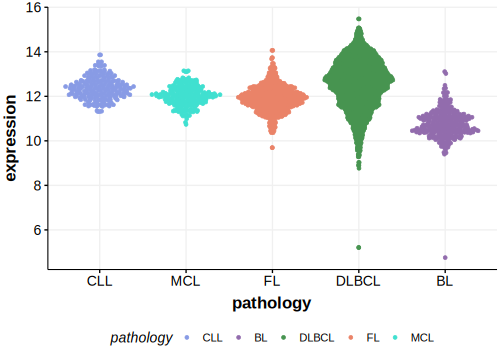

[[_TOC_]]

## Relevance tier by entity

[[include:tables/table1_PTPN1.md]]

## Mutation incidence in large patient cohorts (GAMBL reanalysis)

|Entity|source        |frequency (%)|
|:------:|:--------------:|:-------------:|
|DLBCL |GAMBL genomes |0.19         |
|DLBCL |Schmitz cohort|1.06         |
|DLBCL |Reddy cohort  |1.40         |
|DLBCL |Chapuy cohort |0.43         |

## Mutation pattern and selective pressure estimates

|Entity|aSHM|Significant selection|dN/dS (missense)|dN/dS (nonsense)|
|:------:|:----:|:---------------------:|:----------------:|:----------------:|
|BL    |Yes |No                   |0               |0               |
|DLBCL |Yes |No                   |0               |0               |
|FL    |Yes |No                   |0               |0               |

## aSHM regions

|chr_name|hg19_start|hg19_end|region                                                                                    |regulatory_comment|
|:--------:|:----------:|:--------:|:------------------------------------------------------------------------------------------:|:------------------:|
|chr20   |49120482  |49140477|[TSS](https://genome.ucsc.edu/s/rdmorin/GAMBL%20hg19?position=chr20%3A49120482%2D49140477)|active_promoter   |

[[include:browser_PTPN1.md]]

## Expression

<!-- ORIGIN: gunawardanaRecurrentSomaticMutations2014c -->
<!-- PMBL: gunawardanaRecurrentSomaticMutations2014c -->

[[include:tables/mermaid_PTPN1.md]]

## References

