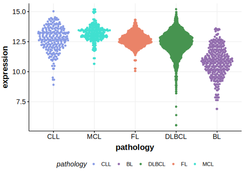

[[_TOC_]]

## Experimental Evidence

Driver mutations affecting this gene in DLBCL have been experimentally demonstrated to cause a reduction or loss of function (LOF).[@demosthenousLossFunctionMutations2015]

## Relevance tier by entity

[[include:tables/table1_PTPN6.md]]

## Mutation incidence in large patient cohorts (GAMBL reanalysis)

### DLBCL
[[include:tables/DLBCL_PTPN6.md]]

## Mutation pattern and selective pressure estimates

[[include:tables/dnds_PTPN6.md]]

[[include:browser_PTPN6.md]]

## Expression

<!-- ORIGIN: reddyGeneticFunctionalDrivers2017 -->
<!-- DLBCL: reddyGeneticFunctionalDrivers2017 -->

[[include:tables/mermaid_PTPN6.md]]

## References

