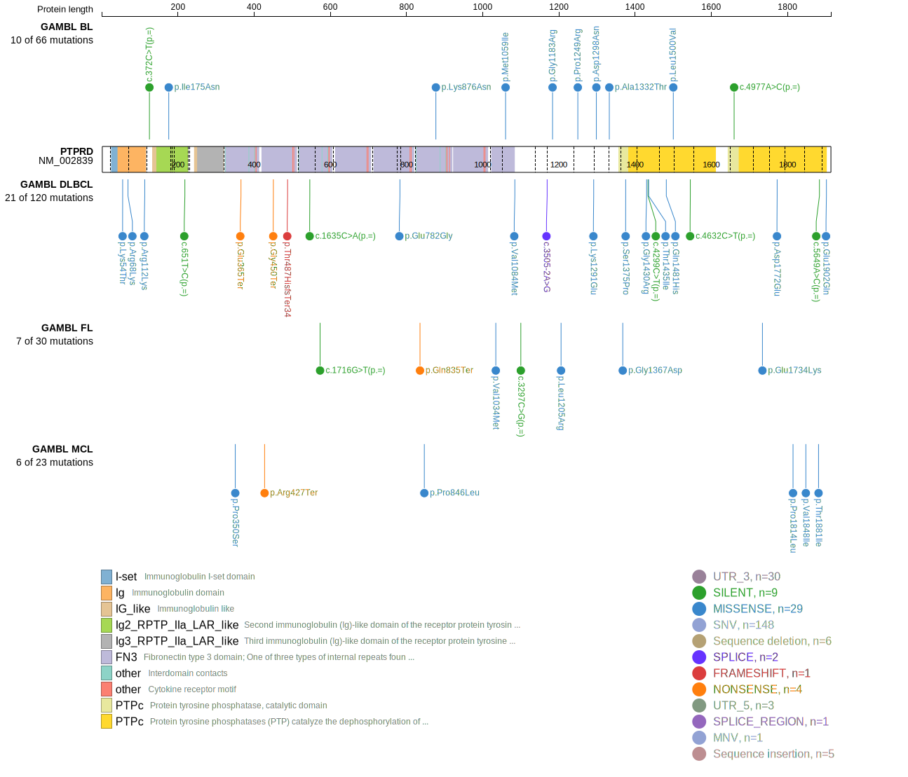

# [PTPRD]

## Mutation tier

|Entity|Tier|Description               |
|:------:|:----:|--------------------------|
|DLBCL |1   |high-confidence DLBCL gene|
|FL    |1   |high-confidence FL gene   |
## Mutation incidence

|Entity|source        |frequency (%)|
|:------:|:--------------:|:-------------:|
|DLBCL |GAMBL genomes |5.54         |
|DLBCL |Schmitz cohort|7.66         |
|DLBCL |Reddy cohort  |5.21         |
|DLBCL |Chapuy cohort |5.56         |
|FL    |GAMBL genomes |3.70         |

## Mutation pattern

|Entity|aSHM|Significant selection|dN/dS (missense)|dN/dS (nonsense)|
|:------:|:----:|:---------------------:|:----------------:|:----------------:|
|BL    |No  |No                   |1.905           |0.000           |
|DLBCL |No  |No                   |0.969           |0.000           |
|FL    |No  |No                   |1.549           |3.769           |

 ## PTPRD Hotspots

| Chromosome |Coordinate (hg19) | ref>alt | HGVSp | 
 | :---:| :---: | :--: | :---: |
| chr9 | 8376670 | T>G | Q1481H |

View coding variants in ProteinPaint [hg19](https://www.bcgsc.ca/downloads/morinlab/GAMBL/test/genes/PTPRD_protein.html)  or [hg38](https://www.bcgsc.ca/downloads/morinlab/GAMBL/test/genes/PTPRD_protein_hg38.html)

View all variants in GenomePaint [hg19](https://www.bcgsc.ca/downloads/morinlab/GAMBL/test/genes/PTPRD.html)  or [hg38](https://www.bcgsc.ca/downloads/morinlab/GAMBL/test/genes/PTPRD_hg38.html)

