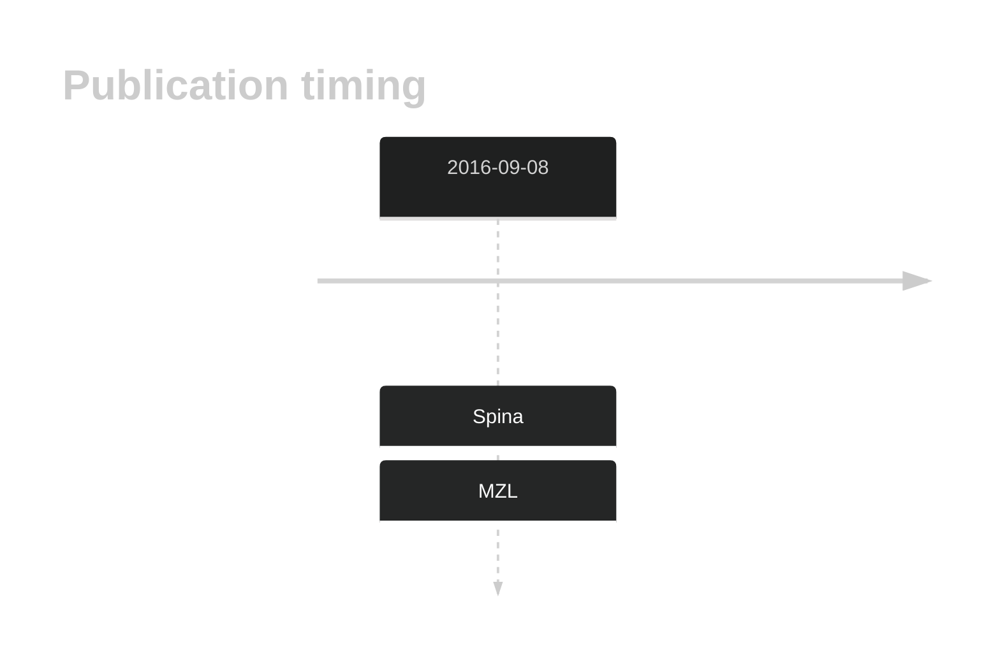

# PTPRD
## History

## Relevance tier by entity

|Entity|Tier|Description               |
|:------:|:----:|--------------------------|
||1|high-confidence MZL gene|
||1|high-confidence PMBL/cHL/GZL gene|
| |1   |high-confidence DLBCL gene|
|    |1   |high-confidence FL gene   |

## Mutation incidence in large patient cohorts (GAMBL reanalysis)

|Entity|source        |frequency (%)|
|:------:|:--------------:|:-------------:|
|DLBCL |GAMBL genomes |5.54         |
|DLBCL |Schmitz cohort|7.66         |
|DLBCL |Reddy cohort  |5.21         |
|DLBCL |Chapuy cohort |5.56         |
|FL    |GAMBL genomes |3.70         |

## Mutation pattern and selective pressure estimates

|Entity|aSHM|Significant selection|dN/dS (missense)|dN/dS (nonsense)|
|:------:|:----:|:---------------------:|:----------------:|:----------------:|
|BL    |No  |No                   |1.905           |0.000           |
|DLBCL |No  |No                   |0.969           |0.000           |
|FL    |No  |No                   |1.549           |3.769           |

 ## PTPRD Hotspots

| Chromosome |Coordinate (hg19) | ref>alt | HGVSp | 
 | :---:| :---: | :--: | :---: |
| chr9 | 8376670 | T>G | Q1481H |

View coding variants in ProteinPaint [hg19](https://morinlab.github.io/LLMPP/GAMBL/PTPRD_protein.html)  or [hg38](https://morinlab.github.io/LLMPP/GAMBL/PTPRD_protein_hg38.html)

View all variants in GenomePaint [hg19](https://morinlab.github.io/LLMPP/GAMBL/PTPRD.html)  or [hg38](https://morinlab.github.io/LLMPP/GAMBL/PTPRD_hg38.html)

## PTPRD Expression

<!-- ORIGIN: spinaGeneticsNodalMarginal2016b -->
<!-- MZL: spinaGeneticsNodalMarginal2016b -->
## References
1.  Spina V, Khiabanian H, Messina M, Monti S, Cascione L, Bruscaggin A, Spaccarotella E, Holmes AB, Arcaini L, Lucioni M, Tabbò F, Zairis S, Diop F, Cerri M, Chiaretti S, Marasca R, Ponzoni M, Deaglio S, Ramponi A, Tiacci E, Pasqualucci L, Paulli M, Falini B, Inghirami G, Bertoni F, Foà R, Rabadan R, Gaidano G, Rossi D. The genetics of nodal marginal zone lymphoma. Blood. 2016 Sep 8;128(10):1362–1373. 
