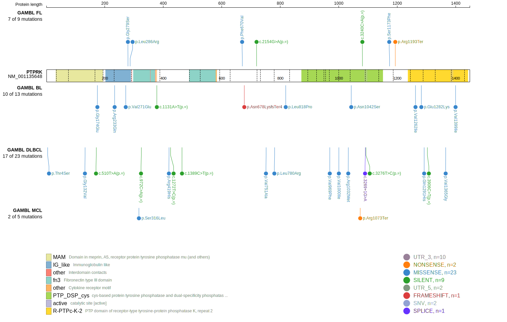
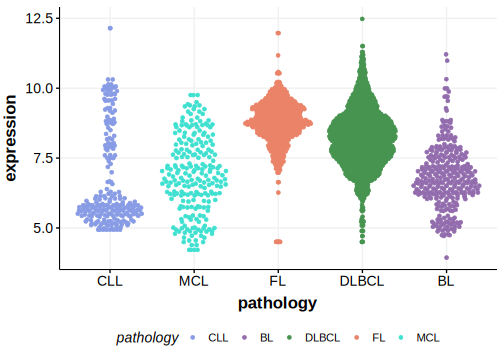

# PTPRK

## Relevance tier by entity

|Entity|Tier|Description                              |
|:------:|:----:|-----------------------------------------|
|DLBCL |2   |relevance in DLBCL not firmly established|

## Mutation incidence in large patient cohorts (GAMBL reanalysis)

|Entity|source        |frequency (%)|
|:------:|:--------------:|:-------------:|
|DLBCL |GAMBL genomes |4.21         |
|DLBCL |Schmitz cohort|3.62         |
|DLBCL |Reddy cohort  |3.30         |
|DLBCL |Chapuy cohort |6.41         |

## Mutation pattern and selective pressure estimates

|Entity|aSHM|Significant selection|dN/dS (missense)|dN/dS (nonsense)|
|:------:|:----:|:---------------------:|:----------------:|:----------------:|
|BL    |No  |No                   |2.146           |0.000           |
|DLBCL |No  |No                   |1.555           |1.797           |
|FL    |No  |No                   |1.875           |5.021           |

> [!NOTE]
> First described in DLBCL in 2017 by [Reddy A](https://pubmed.ncbi.nlm.nih.gov/28985567)

View coding variants in ProteinPaint [hg19](https://morinlab.github.io/LLMPP/GAMBL/PTPRK_protein.html)  or [hg38](https://morinlab.github.io/LLMPP/GAMBL/PTPRK_protein_hg38.html)

View all variants in GenomePaint [hg19](https://morinlab.github.io/LLMPP/GAMBL/PTPRK.html)  or [hg38](https://morinlab.github.io/LLMPP/GAMBL/PTPRK_hg38.html)

## PTPRK Expression

<!-- ORIGIN: reddyGeneticFunctionalDrivers2017 -->
