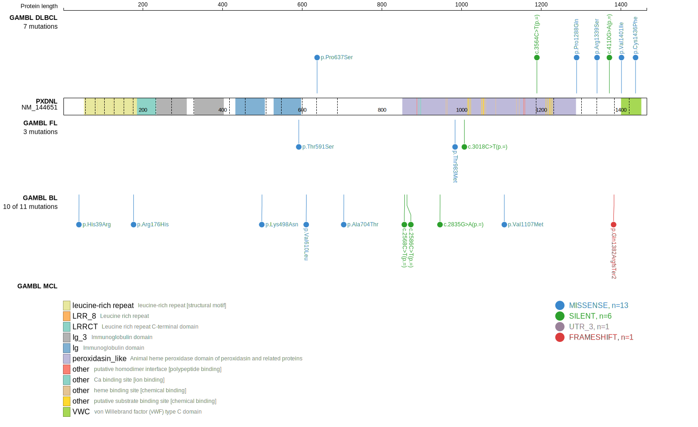
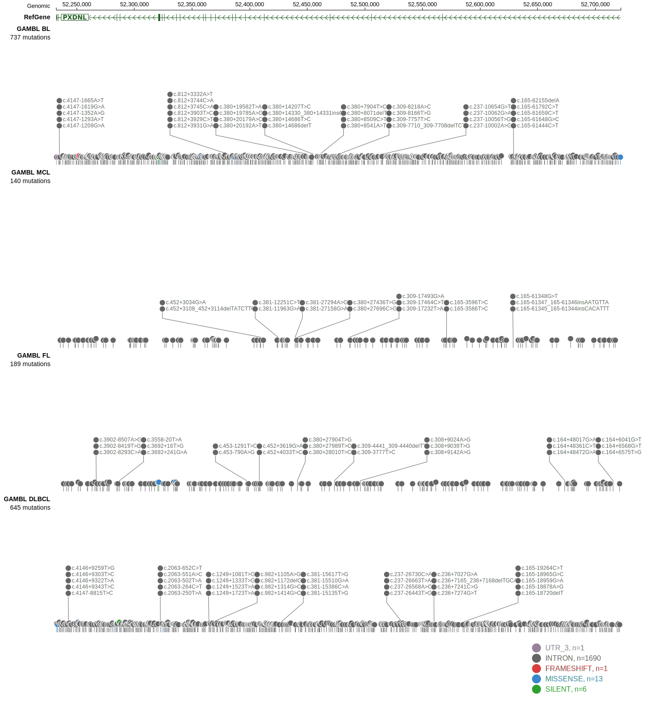

# PXDNL

## Relevance tier by entity

|Entity|Tier|Description                           |
|:------:|:----:|--------------------------------------|
|BL    |2   |relevance in BL not firmly established|

## Mutation incidence in large patient cohorts (GAMBL reanalysis)

|Entity|source               |frequency (%)|
|:------:|:---------------------:|:-------------:|
|BL    |GAMBL genomes+capture|4.62         |
|BL    |Thomas cohort        |3.00         |
|BL    |Panea cohort         |9.90         |

## Mutation pattern and selective pressure estimates

|Entity|aSHM|Significant selection|dN/dS (missense)|dN/dS (nonsense)|
|:------:|:----:|:---------------------:|:----------------:|:----------------:|
|BL    |No  |No                   |1.255           |0               |
|DLBCL |No  |No                   |1.924           |0               |
|FL    |No  |No                   |1.165           |0               |

> [!NOTE]
> First described in BL in 2019 by [Panea RI](https://pubmed.ncbi.nlm.nih.gov/31558468)

View coding variants in ProteinPaint [hg19](https://morinlab.github.io/LLMPP/GAMBL/PXDNL_protein.html)  or [hg38](https://morinlab.github.io/LLMPP/GAMBL/PXDNL_protein_hg38.html)

View all variants in GenomePaint [hg19](https://morinlab.github.io/LLMPP/GAMBL/PXDNL.html)  or [hg38](https://morinlab.github.io/LLMPP/GAMBL/PXDNL_hg38.html)

## PXDNL Expression

