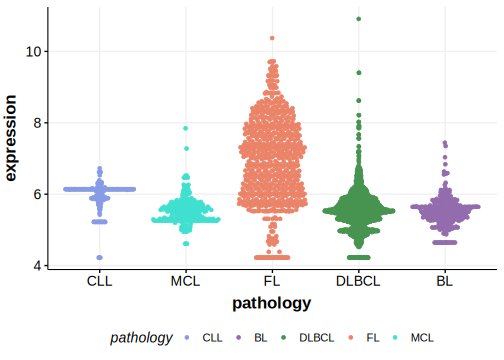

[[_TOC_]]

## Relevance tier by entity

[[include:table1_PZP.md]]

## Mutation incidence in large patient cohorts (GAMBL reanalysis)

|Entity|source       |frequency (%)|
|:------:|:-------------:|:-------------:|
|FL    |GAMBL genomes|0.92         |

## Mutation pattern and selective pressure estimates

[[include:tables/dnds_PZP.md]]

[[include:browser_PZP.md]]

## Expression

<!-- ORIGIN: russler-germainMutationsAssociatedProgression2023a -->
<!-- FL: russler-germainMutationsAssociatedProgression2023b -->

[[include:mermaid_PZP.md]]

## References

