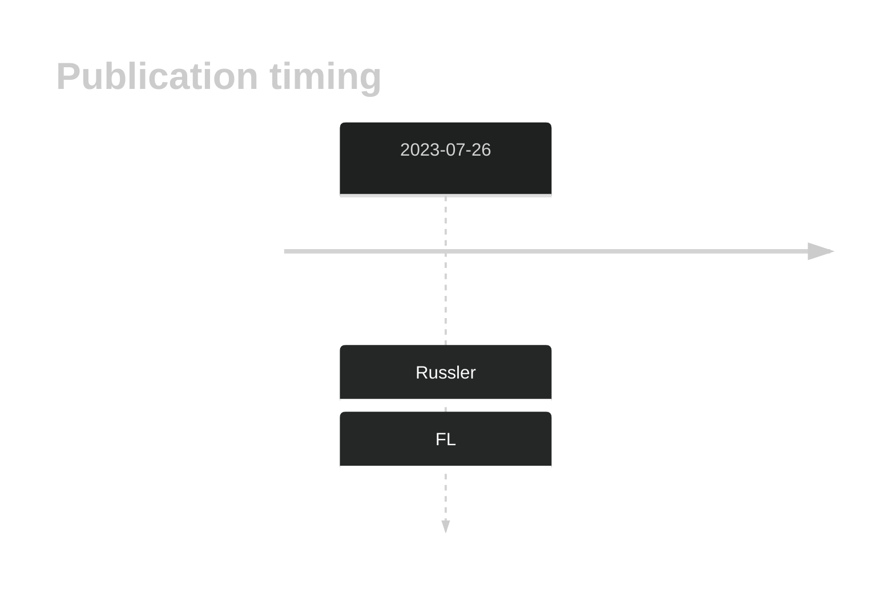

# PZP
## History

## Relevance tier by entity

|Entity|Tier|Description                           |
|:------:|:----:|--------------------------------------|
|    |2   |relevance in FL not firmly established|

## Mutation incidence in large patient cohorts (GAMBL reanalysis)

|Entity|source       |frequency (%)|
|:------:|:-------------:|:-------------:|
|FL    |GAMBL genomes|0.92         |

## Mutation pattern and selective pressure estimates

|Entity|aSHM|Significant selection|dN/dS (missense)|dN/dS (nonsense)|
|:------:|:----:|:---------------------:|:----------------:|:----------------:|
|BL    |No  |No                   |0.936           |0               |
|DLBCL |No  |No                   |0.273           |0               |
|FL    |No  |No                   |1.723           |0               |

View coding variants in ProteinPaint [hg19](https://morinlab.github.io/LLMPP/GAMBL/PZP_protein.html)  or [hg38](https://morinlab.github.io/LLMPP/GAMBL/PZP_protein_hg38.html)

View all variants in GenomePaint [hg19](https://morinlab.github.io/LLMPP/GAMBL/PZP.html)  or [hg38](https://morinlab.github.io/LLMPP/GAMBL/PZP_hg38.html)

## PZP Expression

<!-- ORIGIN: russler-germainMutationsAssociatedProgression2023a -->
<!-- FL: russler-germainMutationsAssociatedProgression2023a -->
## References
1.  Russler-Germain DA, Krysiak K, Ramirez CA, Mosior M, Watkins MP, Gomez F, Skidmore ZL, Trani L, Gao F, Geyer S, Cashen A, Mehta-Shah N, Kahl B, Bartlett N, Alderuccio J, Lossos I, Ondrejka S, Hsi E, Martin P, Leonard J, Griffith M, Griffith O, Fehniger T. Mutations associated with progression in follicular lymphoma predict inferior outcomes at diagnosis: Alliance A151303. Blood Advances. 2023;7:5524–5539. 
