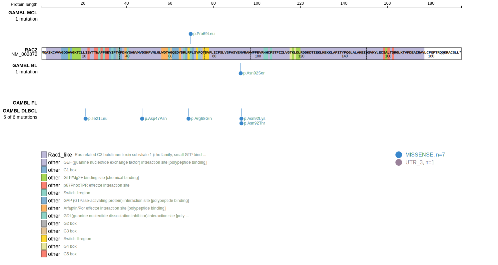
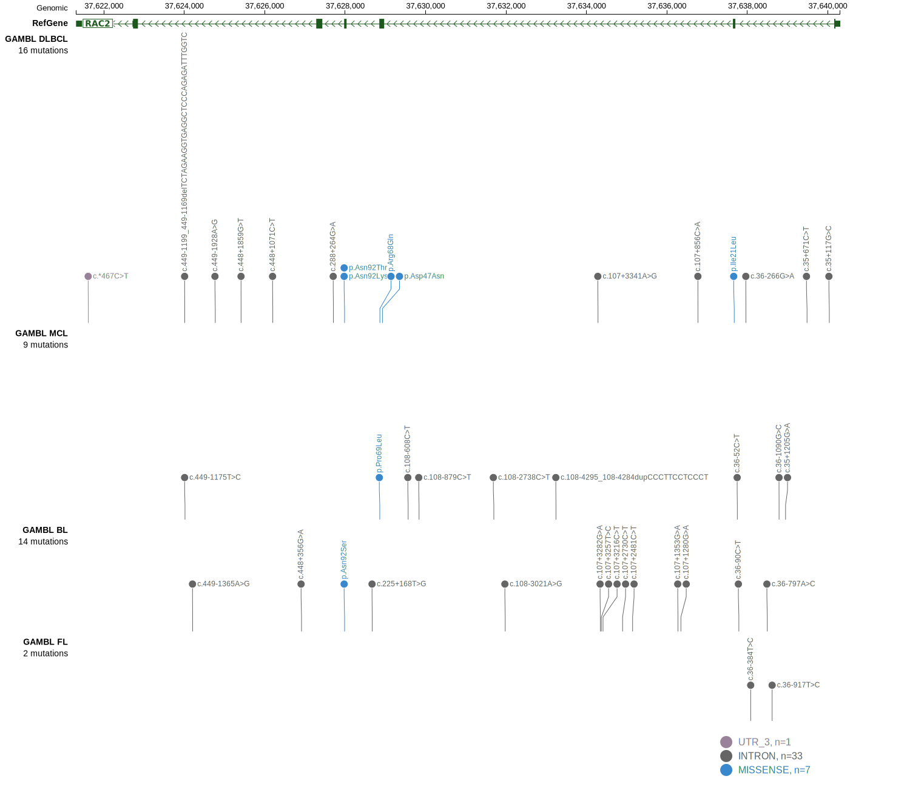
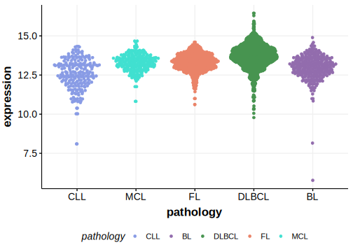

# RAC2

## Relevance tier by entity

|Entity|Tier|Description                              |
|:------:|:----:|-----------------------------------------|
|BL    |2   |relevance in BL not firmly established   |
|DLBCL |2   |relevance in DLBCL not firmly established|

## Mutation incidence in large patient cohorts (GAMBL reanalysis)

|Entity|source               |frequency (%)|
|:------:|:---------------------:|:-------------:|
|BL    |GAMBL genomes+capture|0.69         |
|BL    |Thomas cohort        |0.40         |
|BL    |Panea cohort         |  NA         |
|DLBCL |GAMBL genomes        |1.15         |
|DLBCL |Schmitz cohort       |1.70         |
|DLBCL |Reddy cohort         |1.20         |
|DLBCL |Chapuy cohort        |1.28         |

## Mutation pattern and selective pressure estimates

|Entity|aSHM|Significant selection|dN/dS (missense)|dN/dS (nonsense)|
|:------:|:----:|:---------------------:|:----------------:|:----------------:|
|BL    |No  |No                   |9.926           |0               |
|DLBCL |No  |No                   |6.256           |0               |
|FL    |No  |No                   |0.000           |0               |

> [!NOTE]
> First described in BL in 2019 by [Panea RI](https://pubmed.ncbi.nlm.nih.gov/31558468). First described in DLBCL in 2021 by [Hübschmann D](https://pubmed.ncbi.nlm.nih.gov/33953289)

 ## RAC2 Hotspots

| Chromosome |Coordinate (hg19) | ref>alt | HGVSp | 
 | :---:| :---: | :--: | :---: |
| chr22 | 37627984 | G>T | N92K |
| chr22 | 37627985 | T>C | N92S |
| chr22 | 37627985 | T>G | N92T |

View coding variants in ProteinPaint [hg19](https://morinlab.github.io/LLMPP/GAMBL/RAC2_protein.html)  or [hg38](https://morinlab.github.io/LLMPP/GAMBL/RAC2_protein_hg38.html)

View all variants in GenomePaint [hg19](https://morinlab.github.io/LLMPP/GAMBL/RAC2.html)  or [hg38](https://morinlab.github.io/LLMPP/GAMBL/RAC2_hg38.html)

## RAC2 Expression

